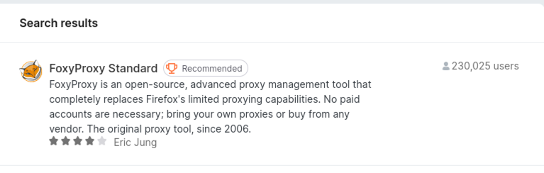
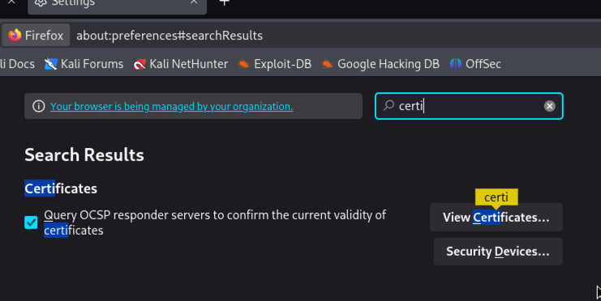

## h1 Kybertappoketju

Tehtävät ovat Tero Karvisen opintojaksolta [Tunkeutumistestaus](https://terokarvinen.com/tunkeutumistestaus/)

---

#### Laite jolla tehtävät tehdään:

- Apple MacBook Pro M2 Max
- macOS Sequoia 15.3.2

---

### a) Kali, mikä versio ja millä asennustavalla

- Kali GNU/Linux, version 2025.1
- ARM64 (aarch64)
- UTM QEMU 9.1 ARM Virtual Machine

---

### b) Irrota Kali-virtuaalikone verkosta.

Valitsen UTM:ssä virtuaalikoneen networkiksi **Host Only**. Host Only estää virtuaalikoneen pääsyn internettiin ([UTM Documentation: Network Mode](https://docs.getutm.app/settings-qemu/devices/network/network/#network-mode)).


---

### c) Porttiskannaa 1000 tavallisinta tcp-porttia omasta koneestasi (nmap -T4 -A localhost). Selitä komennon paramterit. Analysoi ja selitä tulokset.

#### 1000 tavallisinta tcp-porttia

Portteja on kokonaisuudessaan 65536 (2 potenssiin 16), joista ensimmäisistä 1024 porttia pidetään "yleisinä" portteina (Master OccupytheWeb 2023, 18). Todennäköisesti 1000 tavallisimmalla portilla viitataan juuri näihin.    

#### man nmap

- -T4 nopeuttaa hakua
- -A mahdollistaa OS ja version havainnoinnnin, script skannauksen ja tracerouten 
 
```
nmap -T4 -A localhost
```


Näyttää siltä että nmap tekee juurikin oletuksena hauan 1000 portille. Yhtään porttia ei näytä olevan auki:


---

### d) Asenna kaksi vapaavalintaista demonia ja skannaa uudelleen. Analysoi ja selitä erot.

Kalissa näyttää olevan valmiina apache2 ja ssh:


Käynnistin molemmat:


nmap antoi seuraavan tuloksen:


nmap löysi nyt käynnissä olevien apache2 ja ssh:n avoimet portit. 

---

### e) Asenna Metasploitable 2 virtuaalikoneeseen

Tein oman asennusohjeen, jos jatkossa olisi tarve asentaa udestaan niin voisin tehdä sen sitten nopeasti.

#### Install Metasploitable 2

Asennuksessa ja ohjeen tekemisessä lähteenä käytin YouTube-kanavan Cybercat Labs videota [M1 MacBook Hacking: Metasploitable 2 & Kali Linux](https://www.youtube.com/watch?v=-8GibItV6C0).

###### 1. Lataa Metaspoitable 2

- https://docs.rapid7.com/metasploit/metasploitable-2/

###### 2. Muunna UTM:lle sopivaksi

```
qemu-img convert -O qcow2 Metasploitable.vmdk Metasploitable.qcow2
```

###### 3. UTM

1. Create a New Virtual Machine
2. Emulate
3. Other


Ota UEFI Boot pois


IDE Drive ja Delete


1. Drives
2. New
3. Import
4. valitse se .qcow2


Network Mode: Host Only


###### username password

msfadmin::msfadmin

---

#### f) Tee koneiden välille virtuaaliverkko.

Kuten aiemmin käyttämässäni [Cybercat Labs:n videossa](https://www.youtube.com/watch?v=-8GibItV6C0) kerrotaan UTM:n Network Mode Host Only mahdollistaa sen, että Kali ja Metaspoitable saavat toisiinsa yhteyden, mutta eivät ole yhteydessä internettiin. Tämä käy ilmi myös UTM:n [dokumentaatiosta](https://docs.getutm.app/settings-qemu/devices/network/network/#network-mode) 



Sama toimi myös toisinpäin, eli kun pingasin Metaspoitablesta Kaliin.

---

### g) Etsi Metasploitable porttiskannaamalla (nmap -sn). Tarkista selaimella, että löysit oikean IP:n - Metasploitablen weppipalvelimen etusivulla lukee Metasploitable.

nmap man-sivun mukaan -sn disabloi porttiskannauksen.

```
nmap -sn
```

No targets  


Virtuaalikoneiden käyttämä Host Only verkko tähän pitäisi varmastikin laittaa ja kun  lueskelin [Karvisen sivuja](https://terokarvinen.com/tunkeutumistestaus/), kokeilin laittaa targetiksi Host Only verkon osoitteen ja /24 perään. Tällä löytyi kolme IP-osoitetta: Kalin oma IP-osoite, Metasploitable ja kolmas oli koneeni ifconfigissa näkyvän bridgen osoite. 

Selaimella aukesi tämä sivu:


---

### h) Porttiskannaa Metasploitable huolellisesti ja kaikki portit (nmap -A -T4 -p-). Poimi 2-3 hyökkääjälle kiinnostavinta porttia. Analysoi ja selitä tulokset näiden porttien osalta.

nmap man-sivun mukaan -p- skannaa kaikki porit 1:stä aina portiin 65535.

```
nmap -A -T4 -p-
```

Tietokanta on varmastikkin kiinnostava, koska sehän voi sisältää vaikka mitä tärkeää.  




---

### Lähteet

Tero Karvinen. Tunkeutumistestaus: https://terokarvinen.com/tunkeutumistestaus/

UTM Documentation. Network Mode: https://docs.getutm.app/settings-qemu/devices/network/network/#network-mode

Master OccupytheWeb 2023.
Network Basics for Hackers: How Networks Work and How They Break.
https://www.amazon.com/Network-Basics-Hackers-Networks-Break/dp/B0BS3GZ1R9.

nmap man sivut.

Cybercat Labs. M1 MacBook Hacking: Metasploitable 2 & Kali Linux: https://www.youtube.com/watch?v=-8GibItV6C0

Rapid7. Metasploitable 2 Documentations: https://docs.rapid7.com/metasploit/metasploitable-2/