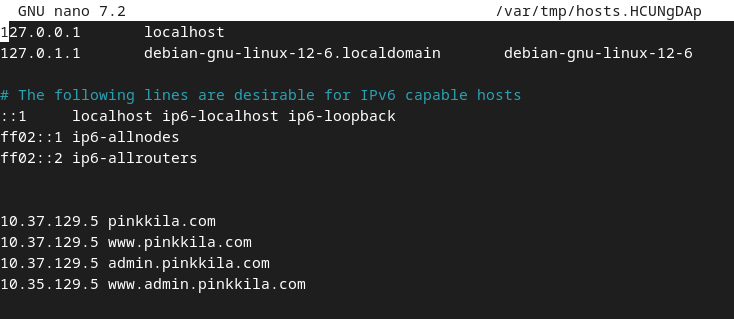

## h1 Kybertappoketju

Tehtävät ovat Tero Karvisen opintojaksolta [Tunkeutumistestaus](https://terokarvinen.com/tunkeutumistestaus/)

---

#### Laite jolla tehtävät tehdään:

- Apple MacBook Pro M2 Max
- macOS Sequoia 15.3.2

---

### x) Lue/katso/kuuntele ja tiivistä.

#### [Herrasmieshakkerit](https://www.withsecure.com/fi/whats-new/podcasts/herrasmieshakkerit) tai [Darknet Diaries](https://darknetdiaries.com/episode/), yksi vapaavalintainen jakso jommasta kummasta.

- Kuuntelin Herrasmieshakkereiden jakson "Tapaus Vastaamo".
- Jaksossa oli vieraana rikosylikomisario Marko Leponen, joka toimi Vastaamon kohdistuneen tietomurron tutkinnan johtajana. 
- Jakso oli todella mielenkiintoinen ja yksittäisinä mielestäni erityisen jänninä asioina olivat mm. että tutkintamatriaali oli yksi betatavu (1000 teraa), poliisi onnistui murtamaan tutkinnan aikana 64 merkkiä pitkän salasanan ja mikä ilmeisesti on erittäin poikkeuksellista, niin poliisi onnistui jäljittämään Monero kryptovaluuttaa. 

#### [Hutchins et al. 2011: Intelligence-Driven Computer Network Defense Informed by Analysis of Adversary Campaigns and Intrusion Kill Chains](https://lockheedmartin.com/content/dam/lockheed-martin/rms/documents/cyber/LM-White-Paper-Intel-Driven-Defense.pdf), chapters Abstract, 3.2 Intrusion Kill Chain.

###### Abstract

- Tietoverkkohyökkäykset ja tapa toteuttaa niitä ovat kehittyneet pitkälle.
- Kybertappoketju auttaa hamottamaan hyökkäysten vaiheita ja parantaa kykyä toteuttaa stategioita ja toimintamalleja
  hyökkäysten torjumiseksi.

###### 3.2 Instrusion Kill Chain

Tunketutumistappoketju koostuu seitsemästä osasta:

1. Reconnaissance: tiedustelu
2. Weaponization: toteutettavan hyökkäyksen valmistelu esim. exploitin asettaminen payloadiin.
3. Delivery: aihemmin tehdyn weaponin toimittaminen
4. Exploitation: aiemmin tehdyn ja toimitetun exploitin laukaisu
5. Installation: exploitin asentuminen kohteeseen
6. Command and Control (C2): vaaraantunut host joutuu usein ottamaan yhteyttä oman verkon ulkopuolelle, jotta hyökkääjät
   saavat hostin kontrollin/hallinnan.
7. Actions on Objectives: Vasta nyt hyökkääjät pystyvät toteuttamaan/saavuttamaan tavoitteensa.


#### Santos et al: The Art of Hacking (Video Collection): [4.3 Surveying Essential Tools for Active Reconnaissance](https://learning.oreilly.com/videos/the-art-of/9780135767849/9780135767849-SPTT_04_00/). Sisältää porttiskannauksen. 5 videota, yhteensä noin 20 min.

- Aktiivinen tiedustelu (Active Reconnaissance) aiheuttaa "melua", eli kohteen on mahdollista havaita tiedustelu.
- On virhe hypätä suoraan haavoittuvuuden skannamiseen ilman kunnollista aktiivista tiedustelu. Voi esim. päätyä
  skannaamaan väärää laitetta tai muuta vastaavaa.


###### nmap

```
nmap -sS -vv -T4 -A {target specification}
```

- -sS tekee TCP send scan, ei tee koko TCP yhteyttä: Skannaa responsen avoimista porteista, ei vastaa serverille. Nopea.
- -vv on verbosity level.
- -T4 lisää skannausen nopeutta
- -A OS detection
- -Pn thret all host as online. Jos skannaa internetissä, nmap saattaa skipta hostin, jos ei ole tätä valintaa johtuen
  kohteen palomuurista (saa ilmeisesti nmap:n luulemaan, että kyseinen host on offline).
- nmap on mahdollista outputata tiedostoon
- defaulttina hakee yleisimmät portit, mutta portteja voi määrittää erikseen. Skannausjärjestyksen voi myös randomoida
  ja jos kohteen järjestelmässä onku joku skannauksen tunnistin, randomointi voi vaikuttaa sen toimivuuteen.

###### masscan

```
masscan -p80,443 192.168.3.0/24 --rate=1000
```

- masscan skannaa nopeasti ja paljon.
- esimerkkinä yllä oleva komento skannaa verkon kaikki 80, ja 433 portit.

###### EyeWithness

- EyeWitness nimisellä ohjelmalla voi ottaa kuvakaappauksia verkkosivuilta: https://github.com/RedSiege/EyeWitness

#### [KKO:2003:36](https://finlex.fi/fi/oikeuskaytanto/korkein-oikeus/ennakkopaatokset/2003/36#OT0)

- A oli skannannut Osuuspankin tietojärjestelmiä.
- Käräjäoikeus hylkäsi syytteen katsoen, että ei ollut riittävää varmuutta siihen oliko A tehnyt teon vai oliko joku muu saanut sen näyttämään A tekemältä.
- Hovioikeus katsoi, että on riittävää näyttöä sille, että A oli suorittanut porttiskannauksen ja määräsi A:n suorittamaan vahingonkorvauksia osuuskunnalle 20 000 ja yhtiölle 55 000 markkaa korkoineen.
- Asia eteni Korkeimpaan oikeuteen, jossa todettiin A:n olleen syyllinen tietomurron yritykseen. 


---

### a) Kali, mikä versio ja millä asennustavalla

- Kali GNU/Linux, version 2025.1
- ARM64 (aarch64)
- UTM QEMU 9.1 ARM Virtual Machine

---

### b) Irrota Kali-virtuaalikone verkosta.

Valitsen UTM:ssä virtuaalikoneen networkiksi **Host Only**. Host Only estää virtuaalikoneen pääsyn
internettiin ([UTM Documentation: Network Mode](https://docs.getutm.app/settings-qemu/devices/network/network/#network-mode)).


---

### c) Porttiskannaa 1000 tavallisinta tcp-porttia omasta koneestasi (nmap -T4 -A localhost). Selitä komennon paramterit. Analysoi ja selitä tulokset.

#### 1000 tavallisinta tcp-porttia

Portteja on kokonaisuudessaan 65536 (2 potenssiin 16), joista ensimmäisistä 1024 porttia pidetään "yleisinä" portteina (
Master OccupytheWeb 2023, 18). Todennäköisesti 1000 tavallisimmalla portilla viitataan juuri näihin.

#### man nmap

- -T4 nopeuttaa hakua
- -A mahdollistaa OS ja version havainnoinnnin, script skannauksen ja tracerouten

```
nmap -T4 -A localhost
```

Näyttää siltä että nmap tekee juurikin oletuksena hauan 1000 portille. Yhtään porttia ei näytä olevan auki:


---

### d) Asenna kaksi vapaavalintaista demonia ja skannaa uudelleen. Analysoi ja selitä erot.

Kalissa näyttää olevan valmiina apache2 ja ssh:



Käynnistin molemmat:


nmap antoi seuraavan tuloksen:


nmap löysi nyt käynnissä olevien apache2 ja ssh:n avoimet portit.

---

### e) Asenna Metasploitable 2 virtuaalikoneeseen

Tein oman asennusohjeen, jos jatkossa olisi tarve asentaa udestaan niin voisin tehdä sen sitten nopeasti. Jos et käytä macOS tai käytät ja sinulla ei ollut mitään ongelmia, niin tämä osuus kannattaa varmaankin vain skipata.

#### Install Metasploitable 2

Asennuksessa ja ohjeen tekemisessä lähteenä käytin YouTube-kanavan Cybercat Labs
videota [M1 MacBook Hacking: Metasploitable 2 & Kali Linux](https://www.youtube.com/watch?v=-8GibItV6C0).

###### 1. Lataa Metaspoitable 2

- https://docs.rapid7.com/metasploit/metasploitable-2/

###### 2. Muunna UTM:lle sopivaksi

```
qemu-img convert -O qcow2 Metasploitable.vmdk Metasploitable.qcow2
```

###### 3. UTM

1. Create a New Virtual Machine
2. Emulate
3. Other


Ota UEFI Boot pois


IDE Drive ja Delete


1. Drives
2. New
3. Import
4. valitse se .qcow2


Network Mode: Host Only


###### username password

msfadmin::msfadmin

---

#### f) Tee koneiden välille virtuaaliverkko.

Kuten aiemmin käyttämässäni [Cybercat Labs:n videossa](https://www.youtube.com/watch?v=-8GibItV6C0) kerrotaan UTM:n
Network Mode Host Only mahdollistaa sen, että Kali ja Metaspoitable saavat toisiinsa yhteyden, mutta eivät ole
yhteydessä internettiin. Tämä käy ilmi myös UTM:
n [dokumentaatiosta](https://docs.getutm.app/settings-qemu/devices/network/network/#network-mode)


Sama toimi myös toisinpäin, eli kun pingasin Metaspoitablesta Kaliin.

---

### g) Etsi Metasploitable porttiskannaamalla (nmap -sn). Tarkista selaimella, että löysit oikean IP:n - Metasploitablen weppipalvelimen etusivulla lukee Metasploitable.

nmap man-sivun mukaan -sn disabloi porttiskannauksen.

```
nmap -sn
```

No targets


Virtuaalikoneiden käyttämä Host Only verkko tähän pitäisi varmastikin laittaa ja kun
lueskelin [Karvisen sivuja](https://terokarvinen.com/tunkeutumistestaus/), kokeilin laittaa targetiksi Host Only verkon
osoitteen ja /24 perään. Tällä löytyi kolme IP-osoitetta: Kalin oma IP-osoite, Metasploitable ja kolmas oli koneeni
ifconfigissa näkyvän bridgen osoite.

Selaimella aukesi tämä sivu:


---

### h) Porttiskannaa Metasploitable huolellisesti ja kaikki portit (nmap -A -T4 -p-). Poimi 2-3 hyökkääjälle kiinnostavinta porttia. Analysoi ja selitä tulokset näiden porttien osalta.

nmap man-sivun mukaan -p- skannaa kaikki porit 1:stä aina portiin 65535.

```
nmap -A -T4 -p-
```

Tietokanta on varmastikin kiinnostava, koska sehän voi sisältää vaikka mitä tärkeää.


---

### Lähteet

Tero Karvinen. Tunkeutumistestaus: https://terokarvinen.com/tunkeutumistestaus/

Herrasmieshakkerit: https://www.withsecure.com/fi/whats-new/podcasts/herrasmieshakkerit

Lockheed Martin Corporation.
Intelligence-Driven Computer Network Defense
Informed by Analysis of Adversary Campaigns and
Intrusion Kill Chains:
https://lockheedmartin.com/content/dam/lockheed-martin/rms/documents/cyber/LM-White-Paper-Intel-Driven-Defense.pdf

RedSiege. EyeWitness: https://github.com/RedSiege/EyeWitness

Santos et al. The Art of Hacking (Video Collection):
https://learning.oreilly.com/videos/the-art-of/9780135767849/9780135767849-SPTT_04_00/

UTM Documentation. Network Mode: https://docs.getutm.app/settings-qemu/devices/network/network/#network-mode

Master OccupytheWeb 2023.
Network Basics for Hackers: How Networks Work and How They Break.
https://www.amazon.com/Network-Basics-Hackers-Networks-Break/dp/B0BS3GZ1R9.

nmap man sivut.

Cybercat Labs. M1 MacBook Hacking: Metasploitable 2 & Kali Linux: https://www.youtube.com/watch?v=-8GibItV6C0

Rapid7. Metasploitable 2 Documentations: https://docs.rapid7.com/metasploit/metasploitable-2/


