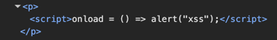

## h1 Kybertappoketju

Tehtävät ovat Tero Karvisen opintojaksolta Tunkeutumistestaus: https://terokarvinen.com/tunkeutumistestaus/.

---

#### Laite jolla tehtävät tehdään:

- Apple MacBook Pro M2 Max
- macOS Sequoia 15.3.2
- Kali GNU/Linux, version 2025.1 ARM64 (aarch64)
- UTM QEMU 9.1 ARM Virtual Machine

---

### x) Lue/katso ja tiivistä.

---

### a) Asenna OWASP ZAP, generoi CA-sertifikaatti ja asenna se selaimeesi.

Asensin zaproxyn seuraavalla komennolla:

```
sudo apt-get install zaproxy
```

Seuraavaksi vaidoin Kalin network moodin Host Only:ksi.


Laiton Zap päälle ja generoin sertifikaatin (Tools - Network - Server Certificate - Save).


Firefox asetuksista etsein certikaattiasetukset hakusanalla:


View Certificates pystyy importoimaan äsken luodun sertifikaatin. 


Asetin Zapin sieppaamaan myös kuvat


Asetin zap proxyksi firefoxiin. Etsein proxy hakusanalla ja laitoin seuraavat asetukset:


Localhost ei toiminut kuten tehtävänannossa sanottiin. Toisen virtuaalikoneen web palvelimella sai testattua toimivuuden. Kuvien toimivuutta ei vielä voinut testata.


---

### b) Asenna "FoxyProxy Standard" Firefox Addon, ja lisää ZAP proxyksi siihen.

Asensin FoxyProxy [^5] addonsin Firefoxiin.


Otin Firefoxin asetuksista Zap pois ja asetin FoxyProxyn asetukse ensin seuraavasti:


Metasploitablen web palvelu toimii taas, mutta localhost ei näy Zapissa. Tämäkään ei vaikuttanut.


Firefox ei huomioi localhostia proxy configurointiin automaattisesti, vaan jättää sen pois ja asetuksia tulee muuttaa [^6].


### c) Reflected XSS into HTML context with nothing encoded [^1]

Kun tutustuin tehtäviin en malttanut olla aloittamatta suoraan tästä. En ole siis vielä tehnyt noita aiempia lukutehtäviä ja lähden kokeilemaan tätä tehtävää nykyisten tietojeni pohjalta. Ymmärtääkseni tehtävän pystyy tekemään pelkällä selaimella, joten kokeillaan pelkästään sillä ensin.

Ensiksi katsoin millaista html:ää input sisältää. Attribuutteina form tagilla on action="/" ja method="GET". action-attribuutissa määritetään URL, jossa formin submit käitellaan ja method="GET" taas aiheuttaa formin datan liittämisen URL:n ? separaattorilla [^2]. Tiedän Reactia tehneenä, että tässä buttonin submit aiheuttaa SubmitEventin (Reactissa tämä tarvii lähes poikkeuksetta estää).


Testatakseni tein seuraavan html:n, joka sisältää:

```
    <form action="/" method="get">
        <input type="text" name="goes_to_url" placeholder="Search the blog...">
        </input>
        <button type="submit">Search</button>
    </form>
```

Ja näin kävi (en aluksi tiennyt, että input name attribuutti menee myös urliin, mutta näköjään menee. (ensimmäisessä kuvassa oleva url tulee IntelliJ automaattisesta websocketista)):


Eli tehtävän koodissa SubmitEvent tässä tapauksessa tekee GET pyynnön palvelimelle ja vastaus muokataan sen mukaisesti, mitä urliin tulee formista eli `?search=input`

Jos tekee normaalin haun sivulla tulee haku osaksi html: 


Kokeilen ensimmäista xss-payloadia, mitä tulee mieleen ja se toimi:

```
<script>alert(0)</script>
```


---

### d) Stored XSS into HTML context with nothing encoded [^3]

Tarkastelin ensin html ja sivu tallentaa kommentteihin syötetyn tekstin varmaankin ihan sellaisenaan ilman mitään tarkastuksia. Kommentti menee p-tagiin. 

Kokeilin ensin omalla html:llä, miten saa laukaistua alertin heti sivun latausvaiheessa. Kun selailin, mitä `window` objektista löytyy, niin löysin `onload`, joka on event, joka laukeaa, kun koko sivu on ladattu [^4]  

Kokeilin seuraavaa payloadia ja se toimi(kokeilin, että window objectin voi jättää pois ja toimii silti). 

```
<script>window.onload = () => alert("xss");</script>
```


Payload tallentuu commentista serverille ja sitä ei escapta missään vaiheessa, vaan se lisääntyy html:ään ajettavana koodina (tämä ei ilmene seuraavasta kuvasta, koska escapattu näyttäisi ihan samalta).



---


---

### Lähteet

Tero Karvinen. Tunkeutumistestaus: https://terokarvinen.com/tunkeutumistestaus/

JetBrains IntelliJ IDEA: Code intellisense.

[^1]: PortSwigger. Lab: Reflected XSS into HTML context with nothing encoded: https://portswigger.net/web-security/cross-site-scripting/reflected/lab-html-context-nothing-encoded

[^2]: mdn web docs. form: The Form element: https://developer.mozilla.org/en-US/docs/Web/HTML/Element/form

[^3]: PortSwigger. Lab: Stored XSS into HTML context with nothing encoded: https://portswigger.net/web-security/cross-site-scripting/stored/lab-html-context-nothing-encoded

[^4]: mdn web docs. Window: load event: https://developer.mozilla.org/en-US/docs/Web/API/Window/load_event

[^5]: Eric Jung, erosman. FoxyProcy Standard: https://addons.mozilla.org/en-US/firefox/addon/foxyproxy-standard/

[^6]: ZAP by Checkmarx. How do you configure ZAP to test an application on localhost? https://www.zaproxy.org/faq/how-do-you-configure-zap-to-test-an-application-on-localhost/