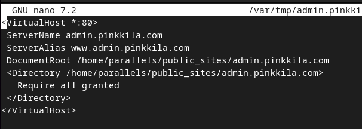
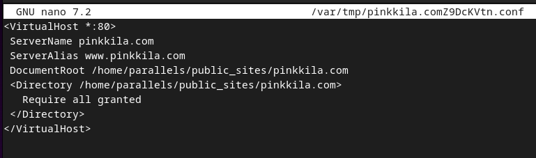

## h1 Kybertappoketju

Tehtävät ovat Tero Karvisen opintojaksolta Tunkeutumistestaus: https://terokarvinen.com/tunkeutumistestaus/.

---

#### Laite jolla tehtävät tehdään:

- Apple MacBook Pro M2 Max
- macOS Sequoia 15.3.2

---

### x) Lue/katso ja tiivistä.

---

### c) Reflected XSS into HTML context with nothing encoded [^1]

Kun tutustuin tehtäviin en malttanut olla aloittamatta suoraan tästä. En ole siis vielä tehnyt noita aiempia lukutehtäviä ja lähden kokeilemaan tätä tehtävää nykyisten tietojeni pohjalta. Ymmärtääkseni tehtävän pystyy tekemään pelkällä selaimella, joten kokeillaan pelkästään sillä ensin.

Ensiksi katsoin millaista html:ää input sisältää. Attribuutteina form tagilla on action="/" ja method="GET". action-attribuutissa määritetään URL, jossa formin submit käitellaan ja method="GET" taas aiheuttaa formin datan liittämisen URL:n ? separaattorilla [^2]. Tiedän Reactia tehneenä, että tässä buttonin submit aiheuttaa SubmitEventin (Reactissa tämä tarvii lähes poikkeuksetta estää).


Testatakseni tein seuraavan html:n, joka sisältää:

```
    <form action="/" method="get">
        <input type="text" name="goes_to_url" placeholder="Search the blog...">
        </input>
        <button type="submit">Search</button>
    </form>
```

Ja näin kävi (en aluksi tiennyt, että input name attribuutti menee myös urliin, mutta näköjään menee. (ensimmäisessä kuvassa oleva url tulee IntelliJ automaattisesta websocketista)):


Eli tehtävän koodissa SubmitEvent tässä tapauksessa tekee GET pyynnön palvelimelle ja vastaus muokataan sen mukaisesti, mitä urliin tulee formista eli `?search=input`

Jos tekee normaalin haun sivulla tulee haku osaksi html: 



Kokeilen ensimmäista xss-payloadia, mitä tulee mieleen ja se toimi:

```
<script>alert(0)</script>
```



---

### Lähteet

Tero Karvinen. Tunkeutumistestaus: https://terokarvinen.com/tunkeutumistestaus/

[^1]: PortSwigger. Lab: Reflected XSS into HTML context with nothing encoded: https://portswigger.net/web-security/cross-site-scripting/reflected/lab-html-context-nothing-encoded

[^2]: mdn web docs. <form>: The Form element: https://developer.mozilla.org/en-US/docs/Web/HTML/Element/form
