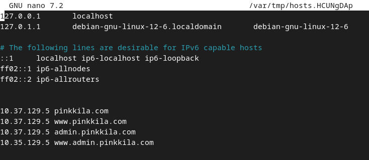
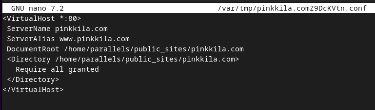
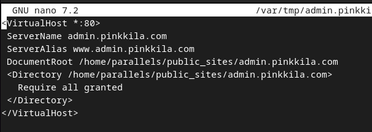

## h3 Fuzzy

Tehtävät ovat Tero Karvisen opintojaksolta [Tunkeutumistestaus](https://terokarvinen.com/tunkeutumistestaus/) [^1]

---

#### Laite jolla tehtävät tehdään:

- Apple MacBook Pro M2 Max
- macOS Sequoia 15.3.2
- Parallels Desktop - Kali Linux 2024.2

---

### x) Lue/katso/kuuntele ja tiivistä. 

- Karvinen 2023: Find Hidden Web Directories - Fuzz URLs with ffuf [^6]

    - Web-palvelimilla on usein salaisia osoitteita, jotka eivät ole linkitettynä mihinkään.
    - Osoitteita voisi koittaa läytää manuaalisesti yksi kerrallaan, mutta tähän on olemassa myös työkaluja kuten ffuf. 
    - ffuf kaltaisia työkaluja kutsutaan fuzzereiksi.
    - ffuf voi fuzzeroida myös headereita, POST parametrejä jne. 
  
- Hoikkala "joohoi" 2020: Still Fuzzing Faster (U fool). In HelSec Virtual meetup #1 [^7]
  
    - Web Fuzzeri lähettää 10-100-10 000-100 000.. pyyntöjä palvelimelle pieneillä variaatioilla ja pyrkii löytämään animalioita sen mukaan, mitä on asetettu filttereiksi.
    - Pyynnössä `GET /helsec/FUZZ HTTP/1.1` "FUZZ" tulee korvatuksi millä tahansa asetetulla payloadilla. Korvattava sana voi olla muuallakin kuin URL:ssa (yksi suosittu on subdomain).  
    - Input content voi olla:

        - salasanalista, käyttäjälista
        - yleiset API-polut
        - yleiset resurssi-polut, parametrien nimet ja arvot
        - muunnelmia validista input datasta.
  
    - Yleisiä kohteita 

        - GET parametrit: parametrin nimet, arvot tai molemmat
        - Headers: Host, authentication, cookies, proxy headers, User Agents (admin or log viewing application), jne. 
        - POST data: form data, JSON, files...

    - Mitä tarkastella, filter ja matcher. (matchers = something that would be flagged as potential mach (matchers and some filters are interoperable), matcher esim. statuskoodi on 200), (filter voi olla jotain esim. response size filter)

        - Response codes
        - Content (regexes \o/)
        - Response sizes (bytes, # of words)

---

### a) Fuzzzz. Ratkaise dirfuz-1 artikkelista Karvinen 2023: Find Hidden Web Directories - Fuzz URLs with ffuf. [^2]

Tehtävän ohjelmaa ei voinut ajaa ARM Macillani, joten tein tehtävät vanhemmalla MacBook Airilla (Intel), johon olen asentanut duol boottina Linuxin.

Olin dirtfuzt-0 tehtävässä asentanut ffuf:n ffuf:n GitHub oheilla. [^8]

```
go install github.com/ffuf/ffuf/v2@latest
```

Ensin latasin tehtävän maaliohjelman ja käynnistin sen.

```
wget https://terokarvinen.com/2023/fuzz-urls-find-hidden-directories/dirfuzt-1
```

```
./dirfuzt-1
```

Aiemmassa tehtävässä dirfuzt-0 oltiin sisällöltään poikkeavan sivun löytämiseksi pyyntöjä filtteröity seuraavalla komennolla:

```
~/go/bin/ffuf -w common.txt -u http://127.0.0.2:8000/FUZZ -fs 132
```

- -w - wordlist [^2]
- -u - target url [^2]
- -fs - filter HTTP response size [^2]

Kokeilin samaa komentoa kuin aiemmassa tehtävässä ja vastauksia responseja tuli yli 4000 eli mitään ei varmaankaan filtteröitynyt. Katsoin, että suurin osa responseista oli kooltaan 154 tavua, joten laitoin sen filtteriksi ja tein muuten saman komennon kuin tehtävässä dirfuzt-0.

```
~/go/bin/ffuf -w common.txt -u http://127.0.0.2:8000/FUZZ -fs 154
```

Tämän jälkeen vastauksia tuli inhimillinen määrä ja testasin olivatko ne mitä haettiin ja olivathan ne. 


### b) Fuff me. Asenna FuffMe-harjoitusmaali. Karvinen 2023: Fuffme - Install Web Fuzzing Target on Debian [^3]

Tehtävän oheilla asensin docker.io:n ja ffuf:n:

```
sudo apt-get install docker.io ffuf
```

Seuraavaksi asensin tehtävän ohjeiden mukaan maalin kloonaamalla sen GitHub repon ja buildaamalla Docker imagen.

```
git clone https://github.com/adamtlangley/ffufme
```
- -t - 

```
sudo docker build -t ffufme .
```

Käynnistin kontin komennolla

- -d - "--detach", ajaa kontaineria taustalla, printtaa containerin id:n [^4]
- -rm - automaattisesti poistaa poistaa kontainerin ja sen anonyymit volumet kun kontainerin ajosta poistutaan [^4]

```
sudo docker run -d --rm -p 80:80 ffufme
```

Kontti toimi ja maali oli asennettu:

- -s - silent, ei näytä progress meter [^5]

```
┌──(parallels㉿kali-linux-2024-2)-[~/Documents/ffufme]
└─$ curl -s localhost|grep title 
    <title>FFUF.me</title>
```

Asensinsin vielä wordlistit maali-kontin pyörittämästä web-palvelimesta:

```
┌──(parallels㉿kali-linux-2024-2)-[~]
└─$ mkdir wordlists

┌──(parallels㉿kali-linux-2024-2)-[~]
└─$ cd wordlists

┌──(parallels㉿kali-linux-2024-2)-[~/wordlists]
└─$ wget http://localhost/wordlist/common.txt
wget http://localhost/wordlist/parameters.txt
wget http://localhost/wordlist/subdomains.txt
--2025-04-12 12:24:55--  http://localhost/wordlist/common.txt
Resolving localhost (localhost)... ::1, 127.0.0.1
Connecting to localhost (localhost)|::1|:80... connected.
HTTP request sent, awaiting response... 200 OK
Length: 37655 (37K) [text/plain]
Saving to: ‘common.txt’

common.txt                           100%[===================================================================>]  36.77K  --.-KB/s    in 0s

2025-04-12 12:24:55 (910 MB/s) - ‘common.txt’ saved [37655/37655]

--2025-04-12 12:24:55--  http://localhost/wordlist/parameters.txt
Resolving localhost (localhost)... ::1, 127.0.0.1
Connecting to localhost (localhost)|::1|:80... connected.
HTTP request sent, awaiting response... 200 OK
Length: 19302 (19K) [text/plain]
Saving to: ‘parameters.txt’

parameters.txt                       100%[===================================================================>]  18.85K  --.-KB/s    in 0s

2025-04-12 12:24:55 (1.10 GB/s) - ‘parameters.txt’ saved [19302/19302]

--2025-04-12 12:24:55--  http://localhost/wordlist/subdomains.txt
Resolving localhost (localhost)... ::1, 127.0.0.1
Connecting to localhost (localhost)|::1|:80... connected.
HTTP request sent, awaiting response... 200 OK
Length: 11957 (12K) [text/plain]
Saving to: ‘subdomains.txt’

subdomains.txt                       100%[===================================================================>]  11.68K  --.-KB/s    in 0s

2025-04-12 12:24:55 (1.17 GB/s) - ‘subdomains.txt’ saved [11957/11957]
```

---

### c) Basic Content Discovery

Tehtävä oli aika pitkälti ohjeistettu alusta loppuun, eikä siinä käytetty uusia parametreja.

```
ffuf -w common.txt -u http://localhost/cd/basic/FUZZ 
```

```bash
┌──(parallels㉿kali-linux-2024-2)-[~/wordlists]
└─$ ffuf -w common.txt -u http://localhost/cd/basic/FUZZ 

        /'___\  /'___\           /'___\       
       /\ \__/ /\ \__/  __  __  /\ \__/       
       \ \ ,__\\ \ ,__\/\ \/\ \ \ \ ,__\      
        \ \ \_/ \ \ \_/\ \ \_\ \ \ \ \_/      
         \ \_\   \ \_\  \ \____/  \ \_\       
          \/_/    \/_/   \/___/    \/_/       

       v2.1.0-dev
________________________________________________

 :: Method           : GET
 :: URL              : http://localhost/cd/basic/FUZZ
 :: Wordlist         : FUZZ: /home/parallels/wordlists/common.txt
 :: Follow redirects : false
 :: Calibration      : false
 :: Timeout          : 10
 :: Threads          : 40
 :: Matcher          : Response status: 200-299,301,302,307,401,403,405,500
________________________________________________

class                   [Status: 200, Size: 19, Words: 4, Lines: 1, Duration: 5ms]
development.log         [Status: 200, Size: 19, Words: 4, Lines: 1, Duration: 4ms]
:: Progress: [4686/4686] :: Job [1/1] :: 0 req/sec :: Duration: [0:00:00] :: Errors: 0 ::
```

```bash
┌──(parallels㉿kali-linux-2024-2)-[~/wordlists]
└─$ curl -s localhost/cd/basic/class 
You Found The File!                                                                                                
┌──(parallels㉿kali-linux-2024-2)-[~/wordlists]
└─$ curl -s localhost/cd/basic/development.log
You Found The File!  
```

---

### d) Content Discovery With Recursion

Myös tämä tehtävä oli ohjeistettu alusta loppuun. Tehtävä esitteli rekursiivisen fuzzauksen, jossa ffuf aloittaa polun löytäessään uuden fuzzauksen [^10].

```
ffuf -w common.txt -recursion -u http://localhost/cd/recursion/FUZZ 
```

```bash
┌──(parallels㉿kali-linux-2024-2)-[~/wordlists]
└─$ ffuf -w common.txt -recursion -u http://localhost/cd/recursion/FUZZ 

        /'___\  /'___\           /'___\       
       /\ \__/ /\ \__/  __  __  /\ \__/       
       \ \ ,__\\ \ ,__\/\ \/\ \ \ \ ,__\      
        \ \ \_/ \ \ \_/\ \ \_\ \ \ \ \_/      
         \ \_\   \ \_\  \ \____/  \ \_\       
          \/_/    \/_/   \/___/    \/_/       

       v2.1.0-dev
________________________________________________

 :: Method           : GET
 :: URL              : http://localhost/cd/recursion/FUZZ
 :: Wordlist         : FUZZ: /home/parallels/wordlists/common.txt
 :: Follow redirects : false
 :: Calibration      : false
 :: Timeout          : 10
 :: Threads          : 40
 :: Matcher          : Response status: 200-299,301,302,307,401,403,405,500
________________________________________________

admin                   [Status: 301, Size: 0, Words: 1, Lines: 1, Duration: 5ms]
[INFO] Adding a new job to the queue: http://localhost/cd/recursion/admin/FUZZ

[INFO] Starting queued job on target: http://localhost/cd/recursion/admin/FUZZ

users                   [Status: 301, Size: 0, Words: 1, Lines: 1, Duration: 3ms]
[INFO] Adding a new job to the queue: http://localhost/cd/recursion/admin/users/FUZZ

[INFO] Starting queued job on target: http://localhost/cd/recursion/admin/users/FUZZ

96                      [Status: 200, Size: 19, Words: 4, Lines: 1, Duration: 4ms]
:: Progress: [4686/4686] :: Job [3/3] :: 0 req/sec :: Duration: [0:00:00] :: Errors: 0 ::
                                                                                                             
┌──(parallels㉿kali-linux-2024-2)-[~/wordlists]
└─$ curl -s localhost/cd/recursion/admin/users/96
You Found The File! 
```
---

### e) Content Discovery With File Extensions

Parametri -e lisää tiedosto tyypin jokaiseen fuzzattavan sanan perään [^10].

```
ffuf -w common.txt -e .log -u http://localhost/cd/ext/logs/FUZZ
```

```
┌──(parallels㉿kali-linux-2024-2)-[~/wordlists]
└─$ ffuf -w ~/wordlists/common.txt -e .log -u http://localhost/cd/ext/logs/FUZZ

        /'___\  /'___\           /'___\       
       /\ \__/ /\ \__/  __  __  /\ \__/       
       \ \ ,__\\ \ ,__\/\ \/\ \ \ \ ,__\      
        \ \ \_/ \ \ \_/\ \ \_\ \ \ \ \_/      
         \ \_\   \ \_\  \ \____/  \ \_\       
          \/_/    \/_/   \/___/    \/_/       

       v2.1.0-dev
________________________________________________

 :: Method           : GET
 :: URL              : http://localhost/cd/ext/logs/FUZZ
 :: Wordlist         : FUZZ: /home/parallels/wordlists/common.txt
 :: Extensions       : .log 
 :: Follow redirects : false
 :: Calibration      : false
 :: Timeout          : 10
 :: Threads          : 40
 :: Matcher          : Response status: 200-299,301,302,307,401,403,405,500
________________________________________________

users.log               [Status: 200, Size: 19, Words: 4, Lines: 1, Duration: 3ms]
:: Progress: [9372/9372] :: Job [1/1] :: 11764 req/sec :: Duration: [0:00:01] :: Errors: 0 ::
                                                                                                             
┌──(parallels㉿kali-linux-2024-2)-[~/wordlists]
└─$ curl -s localhost/cd/ext/logs/users.log      
You Found The File! 
```

### f) No 404 Status

Tämä oli käytännössä sama tehtävä kuin a, jossa filtteröitiin koon perusteella.

```
ffuf -w ~/wordlists/common.txt -u http://localhost/cd/no404/FUZZ -fs 669 
```

```bash
┌──(parallels㉿kali-linux-2024-2)-[~/wordlists]
└─$ ffuf -w ~/wordlists/common.txt -u http://localhost/cd/no404/FUZZ -fs 669        

        /'___\  /'___\           /'___\       
       /\ \__/ /\ \__/  __  __  /\ \__/       
       \ \ ,__\\ \ ,__\/\ \/\ \ \ \ ,__\      
        \ \ \_/ \ \ \_/\ \ \_\ \ \ \ \_/      
         \ \_\   \ \_\  \ \____/  \ \_\       
          \/_/    \/_/   \/___/    \/_/       

       v2.1.0-dev
________________________________________________

 :: Method           : GET
 :: URL              : http://localhost/cd/no404/FUZZ
 :: Wordlist         : FUZZ: /home/parallels/wordlists/common.txt
 :: Follow redirects : false
 :: Calibration      : false
 :: Timeout          : 10
 :: Threads          : 40
 :: Matcher          : Response status: 200-299,301,302,307,401,403,405,500
 :: Filter           : Response size: 669
________________________________________________

secret                  [Status: 200, Size: 25, Words: 4, Lines: 1, Duration: 3ms]
:: Progress: [4686/4686] :: Job [1/1] :: 0 req/sec :: Duration: [0:00:00] :: Errors: 0 ::
                                                                                                             
┌──(parallels㉿kali-linux-2024-2)-[~/wordlists]
└─$ curl -s localhost/cd/no404/secret      
Controller does not exist 
```

Jostain syystä secret on "Controller does not exist" 🤔.

Kokeilin rekursiolla seuraavalla komennolla: 

```
ffuf -w ~/wordlists/common.txt -u http://localhost/cd/no404/FUZZ
```

Vastaus määrä oli suuri ja ainakin kaikki loppupuolen vastaukset olivat kooltaan 669 tavua, joten laiton filtterin `-fs 669` ja mitään ei löytynyt. Ehkä secretin kuuluu olla "Controller does not exits" 

```bash
──(parallels㉿kali-linux-2024-2)-[~/wordlists]
└─$ ffuf -w ~/wordlists/common.txt -u http://localhost/cd/no404/FUZZ -fs 669 

        /'___\  /'___\           /'___\       
       /\ \__/ /\ \__/  __  __  /\ \__/       
       \ \ ,__\\ \ ,__\/\ \/\ \ \ \ ,__\      
        \ \ \_/ \ \ \_/\ \ \_\ \ \ \ \_/      
         \ \_\   \ \_\  \ \____/  \ \_\       
          \/_/    \/_/   \/___/    \/_/       

       v2.1.0-dev
________________________________________________

 :: Method           : GET
 :: URL              : http://localhost/cd/no404/FUZZ
 :: Wordlist         : FUZZ: /home/parallels/wordlists/common.txt
 :: Follow redirects : false
 :: Calibration      : false
 :: Timeout          : 10
 :: Threads          : 40
 :: Matcher          : Response status: 200-299,301,302,307,401,403,405,500
 :: Filter           : Response size: 669
________________________________________________

secret                  [Status: 200, Size: 25, Words: 4, Lines: 1, Duration: 2ms]
:: Progress: [4686/4686] :: Job [1/1] :: 0 req/sec :: Duration: [0:00:00] :: Errors: 0 ::
```
---

### g) Param Mining

Tehtävässä demonstroidaan, että muuttujan FUZZ voi laittaa eri paikkoihin [^7]

```
ffuf -w ~/wordlists/parameters.txt -u http://localhost/cd/param/data?FUZZ=1
```

```bash
┌──(parallels㉿kali-linux-2024-2)-[~/wordlists]
└─$ ffuf -w ~/wordlists/parameters.txt -u http://localhost/cd/param/data?FUZZ=1

        /'___\  /'___\           /'___\       
       /\ \__/ /\ \__/  __  __  /\ \__/       
       \ \ ,__\\ \ ,__\/\ \/\ \ \ \ ,__\      
        \ \ \_/ \ \ \_/\ \ \_\ \ \ \ \_/      
         \ \_\   \ \_\  \ \____/  \ \_\       
          \/_/    \/_/   \/___/    \/_/       

       v2.1.0-dev
________________________________________________

 :: Method           : GET
 :: URL              : http://localhost/cd/param/data?FUZZ=1
 :: Wordlist         : FUZZ: /home/parallels/wordlists/parameters.txt
 :: Follow redirects : false
 :: Calibration      : false
 :: Timeout          : 10
 :: Threads          : 40
 :: Matcher          : Response status: 200-299,301,302,307,401,403,405,500
________________________________________________

debug                   [Status: 200, Size: 24, Words: 3, Lines: 1, Duration: 3ms]
:: Progress: [2588/2588] :: Job [1/1] :: 0 req/sec :: Duration: [0:00:00] :: Errors: 0 ::
                                                                                                             
┌──(parallels㉿kali-linux-2024-2)-[~/wordlists]
└─$ curl -s localhost/cd/param/data?debug=1
Required Parameter Found  
```
---

### h) Rate Limited

Tehtävässä demonstroidaan ffuf ominaisuuttaa fuffazata hitaammin, jotta sovelluksen ratelimiter (tehtävän ratelimiter 50 pyyntöä sekunnissa) ei estä pyyntöjä [^10]. HTTP status 429 Too Many Request indikoi, että pyyntöjä on lähetetty liikaa tietyssä ajassa [^12].

- -t - säikeiden määrä [^9]. Tekee (tässä) 5 versiota ffuf:sta, josta seuraa, että maksimissaan sekunnissa tehdään 50 pyyntöä [^10]
- -p - ffuf pitää määritellyn tauon (tässä 0.1 sekuntia) pyyntöjen välissä
- -mc - rajaa mitkä statuksen näytetään (tässä 200 ja 429) 

Kun ajoin ensimmäisen komennon komennon, en saanut tehtävässä kuvattu 429 statuksen responseja. Kaikki pyynnöt menivät erroriin. 

```bash
┌──(parallels㉿kali-linux-2024-2)-[~/wordlists]
└─$ ffuf -w ~/wordlists/common.txt -u http://ffuf.test/cd/rate/FUZZ -mc 200,429

        /'___\  /'___\           /'___\       
       /\ \__/ /\ \__/  __  __  /\ \__/       
       \ \ ,__\\ \ ,__\/\ \/\ \ \ \ ,__\      
        \ \ \_/ \ \ \_/\ \ \_\ \ \ \ \_/      
         \ \_\   \ \_\  \ \____/  \ \_\       
          \/_/    \/_/   \/___/    \/_/       

       v2.1.0-dev
________________________________________________

 :: Method           : GET
 :: URL              : http://ffuf.test/cd/rate/FUZZ
 :: Wordlist         : FUZZ: /home/parallels/wordlists/common.txt
 :: Follow redirects : false
 :: Calibration      : false
 :: Timeout          : 10
 :: Threads          : 40
 :: Matcher          : Response status: 200,429
________________________________________________

:: Progress: [4686/4686] :: Job [1/1] :: 3389 req/sec :: Duration: [0:00:01] :: Errors: 4686 ::
```

Huomasin, että tehtävänannossa annettu komento sisälsi eri urlin kuin aiemmin, eikä kohdistunut maaliin. En tiedä miksi tehtävänantoon oli laitettu eri url, mutta kun vaihdoin urlin `http://localhost/cd/rate/FUZZ`, niin sain tehtävässä kuvatut 429 statuksen responset. 

```bash
~mail                   [Status: 429, Size: 178, Words: 8, Lines: 8, Duration: 0ms]
~user                   [Status: 429, Size: 178, Words: 8, Lines: 8, Duration: 0ms]
~webmaster              [Status: 429, Size: 178, Words: 8, Lines: 8, Duration: 0ms]
~www                    [Status: 429, Size: 178, Words: 8, Lines: 8, Duration: 0ms]
:: Progress: [4686/4686] :: Job [1/1] :: 0 req/sec :: Duration: [0:00:00] :: Errors: 0 ::
```

Kokeilin vielä niin, että laitoin matcheriksi vain 200 statuksen responset ja yhtään ei löytynyt (koska kaikki todellakin jäävät ratelimitteriin).

```bash
┌──(parallels㉿kali-linux-2024-2)-[~/wordlists]
└─$ ffuf -w ~/wordlists/common.txt -u http://localhost/cd/rate/FUZZ -mc 200    

        /'___\  /'___\           /'___\       
       /\ \__/ /\ \__/  __  __  /\ \__/       
       \ \ ,__\\ \ ,__\/\ \/\ \ \ \ ,__\      
        \ \ \_/ \ \ \_/\ \ \_\ \ \ \ \_/      
         \ \_\   \ \_\  \ \____/  \ \_\       
          \/_/    \/_/   \/___/    \/_/       

       v2.1.0-dev
________________________________________________

 :: Method           : GET
 :: URL              : http://localhost/cd/rate/FUZZ
 :: Wordlist         : FUZZ: /home/parallels/wordlists/common.txt
 :: Follow redirects : false
 :: Calibration      : false
 :: Timeout          : 10
 :: Threads          : 40
 :: Matcher          : Response status: 200
________________________________________________

:: Progress: [4686/4686] :: Job [1/1] :: 0 req/sec :: Duration: [0:00:00] :: Errors: 0 ::
```

Seuraavaksi ajoin tehtävänannon komennon localhost osoitteella ja sain oikean tuloksen.

```
ffuf -w ~/wordlists/common.txt -t 5 -p 0.1 -u http://localhost/cd/rate/FUZZ -mc 200,429
```

```bash
┌──(parallels㉿kali-linux-2024-2)-[~/wordlists]
└─$ ffuf -w ~/wordlists/common.txt -t 5 -p 0.1 -u http://localhost/cd/rate/FUZZ -mc 200,429

        /'___\  /'___\           /'___\       
       /\ \__/ /\ \__/  __  __  /\ \__/       
       \ \ ,__\\ \ ,__\/\ \/\ \ \ \ ,__\      
        \ \ \_/ \ \ \_/\ \ \_\ \ \ \ \_/      
         \ \_\   \ \_\  \ \____/  \ \_\       
          \/_/    \/_/   \/___/    \/_/       

       v2.1.0-dev
________________________________________________

 :: Method           : GET
 :: URL              : http://localhost/cd/rate/FUZZ
 :: Wordlist         : FUZZ: /home/parallels/wordlists/common.txt
 :: Follow redirects : false
 :: Calibration      : false
 :: Timeout          : 10
 :: Threads          : 5
 :: Delay            : 0.10 seconds
 :: Matcher          : Response status: 200,429
________________________________________________

oracle                  [Status: 200, Size: 19, Words: 4, Lines: 1, Duration: 3ms]
:: Progress: [4686/4686] :: Job [1/1] :: 48 req/sec :: Duration: [0:01:37] :: Errors: 0 ::
                                                                                                             
┌──(parallels㉿kali-linux-2024-2)-[~/wordlists]
└─$ curl -s localhost/cd/rate/oracle             
You Found The File!  
```

---

### i) Subdomains - Virtual Host Enumeration

Tehtävässä demonstroidaan, miten ffuf:lla voi fuzzata subdomaineja virtual hosteilla.

- -H - Header `"Name: Value"` erotettuna `:`. Komennossa voi olla useita -H parametrejä. [^9]

Tehtävässä tehdään ensin komento, joka palauttaa paljon false positiivisia responseja, jotka ovat koolta 1 495 tavua.  
```
ffuf -w ~/wordlists/subdomains.txt -H "Host: FUZZ.ffuf.me" -u http://localhost
```

Seuraavaksi filteröidään koon perusteella `-fs 1495` ja saadaan oikea vastaus.

```bash
┌──(parallels㉿kali-linux-2024-2)-[~/wordlists]
└─$ ffuf -w ~/wordlists/subdomains.txt -H "Host: FUZZ.ffuf.me" -u http://localhost -fs 1495        

        /'___\  /'___\           /'___\       
       /\ \__/ /\ \__/  __  __  /\ \__/       
       \ \ ,__\\ \ ,__\/\ \/\ \ \ \ ,__\      
        \ \ \_/ \ \ \_/\ \ \_\ \ \ \ \_/      
         \ \_\   \ \_\  \ \____/  \ \_\       
          \/_/    \/_/   \/___/    \/_/       

       v2.1.0-dev
________________________________________________

 :: Method           : GET
 :: URL              : http://localhost
 :: Wordlist         : FUZZ: /home/parallels/wordlists/subdomains.txt
 :: Header           : Host: FUZZ.ffuf.me
 :: Follow redirects : false
 :: Calibration      : false
 :: Timeout          : 10
 :: Threads          : 40
 :: Matcher          : Response status: 200-299,301,302,307,401,403,405,500
 :: Filter           : Response size: 1495
________________________________________________

redhat                  [Status: 200, Size: 15, Words: 2, Lines: 1, Duration: 0ms]
:: Progress: [1907/1907] :: Job [1/1] :: 0 req/sec :: Duration: [0:00:00] :: Errors: 0 ::
```

Linux palvelimet kurssilla tehtiin Name Based Virtual Hosteja Apache2:lla, jotan halusin kokeilla tätä itse tehdyllä web-palvelimella. 

Otin toisen virtuallikoneen (Debian) ja käytin sillä aiemmin tekemääni verkkosivua jonka ServerName on pinkkila.com ja tein uuden, jonka ServerName on admin.pinkkila.com. Kuvat kertovat toivottasti selkeämmin:







curl komennot näyttävät seuraavilta:

```bash
parallels@debian-gnu-linux-12-6:~$ curl pinkkila.com -v
*   Trying 10.37.129.5:80...
* Connected to pinkkila.com (10.37.129.5) port 80 (#0)
> GET / HTTP/1.1
> Host: pinkkila.com
> User-Agent: curl/7.88.1
> Accept: */*
> 
< HTTP/1.1 200 OK
< Date: Sun, 13 Apr 2025 12:45:05 GMT
< Server: Apache/2.4.62 (Debian)
< Last-Modified: Tue, 08 Apr 2025 13:25:07 GMT
< ETag: "291-6324447fba901"
< Accept-Ranges: bytes
< Content-Length: 657
< Vary: Accept-Encoding
< Content-Type: text/html
< 
<!DOCTYPE html>
<html lang="en">
<head>
    <meta charset="UTF-8">
    <meta name="viewport" content="width=device-width, initial-scale=1.0">
    <title>Pinkkila</title>
    <link rel="stylesheet" href="/styles.css">
</head>
<body>
<div class="container">
    <header class="header">
```

```bash
parallels@debian-gnu-linux-12-6:~$ curl admin.pinkkila.com -v
*   Trying 10.37.129.5:80...
* Connected to admin.pinkkila.com (10.37.129.5) port 80 (#0)
> GET / HTTP/1.1
> Host: admin.pinkkila.com
> User-Agent: curl/7.88.1
> Accept: */*
> 
< HTTP/1.1 200 OK
< Date: Sun, 13 Apr 2025 12:47:15 GMT
< Server: Apache/2.4.62 (Debian)
< Last-Modified: Sun, 13 Apr 2025 11:46:43 GMT
< ETag: "13-632a77d4cac40"
< Accept-Ranges: bytes
< Content-Length: 19
< Content-Type: text/html
< 
This is admin page
* Connection #0 to host admin.pinkkila.com left intact
```

Kun nyt kokeilee ffuf:lla tulee tulee kaikista pyynnöistä response statuksella 200. Kuten edellisestä curl komennosta näkee, admin.pinkkila.com Content-Length on 19 tavua. Eli kaikista pyynnöistä mita-tahansa.pinkkila.com tulee tulee reponsena 200 ja "admin" sivu. Jos käytetään filtteriä koon mukaan, löydetään www.

```bash
┌──(parallels㉿kali-linux-2024-2)-[~/wordlists]
└─$ ffuf -w ~/wordlists/subdomains.txt -H "Host: FUZZ.pinkkila.com" -u http://10.37.129.5 -fs 19

        /'___\  /'___\           /'___\       
       /\ \__/ /\ \__/  __  __  /\ \__/       
       \ \ ,__\\ \ ,__\/\ \/\ \ \ \ ,__\      
        \ \ \_/ \ \ \_/\ \ \_\ \ \ \ \_/      
         \ \_\   \ \_\  \ \____/  \ \_\       
          \/_/    \/_/   \/___/    \/_/       

       v2.1.0-dev
________________________________________________

 :: Method           : GET
 :: URL              : http://10.37.129.5
 :: Wordlist         : FUZZ: /home/parallels/wordlists/subdomains.txt
 :: Header           : Host: FUZZ.pinkkila.com
 :: Follow redirects : false
 :: Calibration      : false
 :: Timeout          : 10
 :: Threads          : 40
 :: Matcher          : Response status: 200-299,301,302,307,401,403,405,500
 :: Filter           : Response size: 19
________________________________________________

www                     [Status: 200, Size: 657, Words: 101, Lines: 31, Duration: 0ms]
:: Progress: [1907/1907] :: Job [1/1] :: 0 req/sec :: Duration: [0:00:00] :: Errors: 0 ::
```

Apache2 dokumentaation mukaan: *"If no matching ServerName or ServerAlias is found in the set of virtual hosts containing the most specific matching IP address and port combination, then the first listed virtual host that matches that will be used."* [^13]. Tämän pystyi todentamaan curl:lla:

```bash
parallels@debian-gnu-linux-12-6:~$ curl 10.37.129.5 -H 'Host: anything.pinkkila.com' -v
*   Trying 10.37.129.5:80...
* Connected to 10.37.129.5 (10.37.129.5) port 80 (#0)
> GET / HTTP/1.1
> Host: anything.pinkkila.com
> User-Agent: curl/7.88.1
> Accept: */*
> 
< HTTP/1.1 200 OK
< Date: Sun, 13 Apr 2025 13:07:36 GMT
< Server: Apache/2.4.62 (Debian)
< Last-Modified: Sun, 13 Apr 2025 11:46:43 GMT
< ETag: "13-632a77d4cac40"
< Accept-Ranges: bytes
< Content-Length: 19
< Content-Type: text/html
< 
This is admin page
* Connection #0 to host 10.37.129.5 left intact
```

Varmistukseksi, että oikea "pääsivu" löytyy kun host on oikein:

```bash
parallels@debian-gnu-linux-12-6:~$ curl 10.37.129.5 -H 'Host: pinkkila.com' -v
*   Trying 10.37.129.5:80...
* Connected to 10.37.129.5 (10.37.129.5) port 80 (#0)
> GET / HTTP/1.1
> Host: pinkkila.com
> User-Agent: curl/7.88.1
> Accept: */*
> 
< HTTP/1.1 200 OK
< Date: Sun, 13 Apr 2025 13:09:26 GMT
< Server: Apache/2.4.62 (Debian)
< Last-Modified: Tue, 08 Apr 2025 13:25:07 GMT
< ETag: "291-6324447fba901"
< Accept-Ranges: bytes
< Content-Length: 657
< Vary: Accept-Encoding
< Content-Type: text/html
< 
<!DOCTYPE html>
<html lang="en">
<head>
    <meta charset="UTF-8">
    <meta name="viewport" content="width=device-width, initial-scale=1.0">
    <title>Pinkkila</title>
    <link rel="stylesheet" href="/styles.css">
</head>
<body>
```

Apache2 pitäis configuroida niin, että jos ServerName:a tai ServerHost:ia ei löydy palautuisi joku geneerinen not found sivu, jos haluaisi tässä myös admin sivun löytää fuzzaamalla. Jätän sen ajanpuutteen vuoksi seuraavaan kertaan. 

---

### Lähteet

[^1]: Tero Karvinen. Tunkeutumistestaus: https://terokarvinen.com/tunkeutumistestaus/

[^2]: Tero Karvinen. Find Hidden Web Directories - Fuzz URLs with ffuf: https://terokarvinen.com/2023/fuzz-urls-find-hidden-directories/ 

[^3]: Tero Karvinen. Fuffme - Install Web Fuzzing Target on Debian: https://terokarvinen.com/2023/fuffme-web-fuzzing-target-debian/

[^4]: Docker Inc. docker container run: https://docs.docker.com/reference/cli/docker/container/run/

[^5]: man culr

[^6]: Tero Karvinen. Find Hidden Web Directories - Fuzz URLs with ffuf: https://terokarvinen.com/2023/fuzz-urls-find-hidden-directories/

[^7]: HelSec. 0x03 Still Fuzzing Faster (U Fool) - joohoi - HelSec Virtual meetup #1: https://www.youtube.com/watch?v=mbmsT3AhwWU

[^8]: ffuf. README.md: https://github.com/ffuf/ffuf/blob/master/README.md

[^9]: ffuf: https://github.com/ffuf/ffuf/tree/master

[^10]: BuildHackSecure. ffufme: https://github.com/BuildHackSecure/ffufme (ohjelman sisältämät infot). 

[^11]: BuildHackSecure. ffufme, Issues: https://github.com/BuildHackSecure/ffufme/issues/1  

[^12]: mdn web docs. 429 Too Many Requests: https://developer.mozilla.org/en-US/docs/Web/HTTP/Reference/Status/429

[^13]: The Apache Software Foundation. Name-based Virtual Host Support: https://httpd.apache.org/docs/current/vhosts/name-based.html