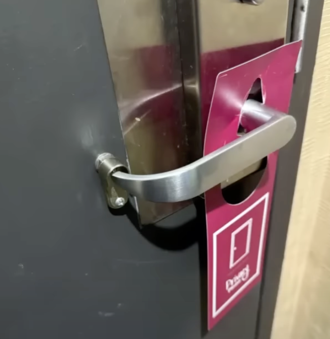

## h6 Maalisuoralla

Tehtävät ovat Tero Karvisen opintojaksolta [Tunkeutumistestaus](https://terokarvinen.com/tunkeutumistestaus/) [^1]

---

#### Laite jolla tehtävät tehdään:

- Apple MacBook Pro M2 Max
- macOS Sequoia 15.3.2
- Parallels Desktop

---

## x) Lue/katso ja tiivistä.

- Deviant Ollam. Vapaavalintainen esitys tai esitelmä esiintyjältä Deviant Ollam.

    - Valitsin katsottavaksi mielenkiintoisella thumbnaililla olleen DeviantOllam videon ovankahvoista. En thumbnailin kuvasta keksinyt, mitä siinä olleella lisäosalla voisi olla tarkoituksena. Varsinainen tarkoitus oli aika hauska ja en halua spoilata sitä 😃 Tarkoitus paljastuu 0:50 kohdassa.
    - 
    - https://www.youtube.com/watch?v=ONmix_70McA

---

## a) Lippuvalmistelu. Valmistele kone ensi viikon lipunryöstöön.

- amd64. Haasteet voivat sisältää amd64-binäärejä.

  - Olen muutamaa tehtävää lukuunottamatta käyttänyt tällä kurssilla Macia (M2), jolla ei natiivisti pyöri amd64 binäärit. Asennan nyt tätä lipunryöstöä varten Parallels Desktopin Rosetalla pyörivän Ubuntun. Tämä toimi Linux-palvelimet kurssilla, niin katsotaan toimiiko myös nyt. Minulla on varuiksi toinen vanhempi Intel Mac johon asennan varmuuden vuoksi Kali virtuaalikoneen. 

- Netti. Koneesta pitää päästä nettiin, jotta voit palauttaa liput.

  - Pääsen nettiin vaihtamalla Host Only nertwork moodin Shared Network moodiin Parallels Desktopin asetuksissa.

- Too many secrets. Opettaja voi tarkastaa lipunryöstön koneesi ja tutkia kaikkia siellä olevia tiedostoja.

  - Kone on uusi virtuaalikone, jolla ei ole yksityistä tietoa.

- Koneella saa olla haluamasi ohjelmat ja työkalut.
   
  - Asensin koneelle kurssilla käytetyistä ohjelmista seuraavat:

    - Wireshark
    - ffuf
    - nmap
    - hashcat
    - hashid
    - john the ripper

- Jos lipunryöstön koneella on muistiinpanoja, niistä on annettava kopio opettajalle sähköpostilla.

  - Ei ole.

- Paikallinen tekoäly.

    - Ei ole.


---

## b) Oma korkki. Demonstroi tunkeutumista itse valitsemallasi luvallisella maalilla.

### Valitsin Hack The Boxista koneen Appointment [^3]

Lämmittelykysymyksenä oli seuraavat

#### What does the acronym SQL stand for?

- structured query language

#### What is one of the most common type of SQL vulnerabilities? 

- sql injection

#### What is the 2021 OWASP Top 10 classification for this vulnerability?

- A03:2021-Injection [^4]

#### What does Nmap report as the service and version that are running on port 80 of the target?

```
nmap -T4 -A 10.129.158.0
```

- Apache httpd 2.4.38 ((Debian)) 

#### What is the standard port used for the HTTPS protocol?

- 443


#### What is a folder called in web-application terminology?

- directory


#### What is the HTTP response code is given for 'Not Found' errors?

- 404

#### Gobuster is one tool used to brute force directories on a webserver. What switch do we use with Gobuster to specify we're looking to discover directories, and not subdomains?

- dir [^5]

#### What single character can be used to comment out the rest of a line in MySQL?

- `#`

#### If user input is not handled carefully, it could be interpreted as a comment. Use a comment to login as admin without knowing the password. What is the first word on the webpage returned?

Laiton koneen osoitteen selaimen osoitekenttään ja login sivu aukesi. 

Käytin aiemmin käytettyä Gobusteria samoilla sanalistoilla mitä käytettiin ffuf:n kanssa, mutta ei sieltä löytynyt mitään hyödyllistä. Käytin mm. seuraavaaa komentoa [^5]:

```
gobuster dir -u 10.129.158.0 -t 50 -w common.txt 
```

Kokeilin lisää vähän mitä sattuu ja kopioitsin pyynnön curlina:

```
curl 'http://10.129.158.0/' --compressed -X POST -H 'User-Agent: Mozilla/5.0 (X11; Linux x86_64; rv:128.0) Gecko/20100101 Firefox/128.0' -H 'Accept: text/html,application/xhtml+xml,application/xml;q=0.9,*/*;q=0.8' -H 'Accept-Language: en-US,en;q=0.5' -H 'Accept-Encoding: gzip, deflate' -H 'Content-Type: application/x-www-form-urlencoded' -H 'Origin: http://10.129.158.0' -H 'Connection: keep-alive' -H 'Referer: http://10.129.158.0/' -H 'Upgrade-Insecure-Requests: 1' -H 'Priority: u=0, i' --data-raw 'username=admin&password=%27%23%27'
```

Kokeilin tuohinkin sattumanvaraisesti kaikkea. Muotoilin siihen myös sql lausetta, mutta en keksinyt miten se olisi siihen sopinut. 

Olen joskus tehnyt ennekin sql injektio harjoituksia ja muistelin, että hipsu tai single quoteja niissä käytettiin, mutta en muistanut miten. Googlasin ja löysin sql injectio cheat sheetin [^6]. 

Sieltä löysin suoraan jo varmaankin sopivan `admin' #` ja se myös toimi. Salasanalla ei ollut väliä. 


---

### Lähteet

[^1]: Tero Karvinen. Tunkeutumistestaus: https://terokarvinen.com/tunkeutumistestaus/

[^2]: DeviantOllam. How Hotels Are Now Preventing Room Break-Ins: https://www.youtube.com/watch?v=ONmix_70McA

[^3]: Hack The Box: Appointment https://app.hackthebox.com/starting-point

[^4]: OWASP Top 10 team: Welcome to the OWASP Top 10 - 2021: https://owasp.org/Top10/

[^5]: man gobuster

[^6]: Invicti Security Corp. SQL injection cheat sheet: https://www.invicti.com/blog/web-security/sql-injection-cheat-sheet/